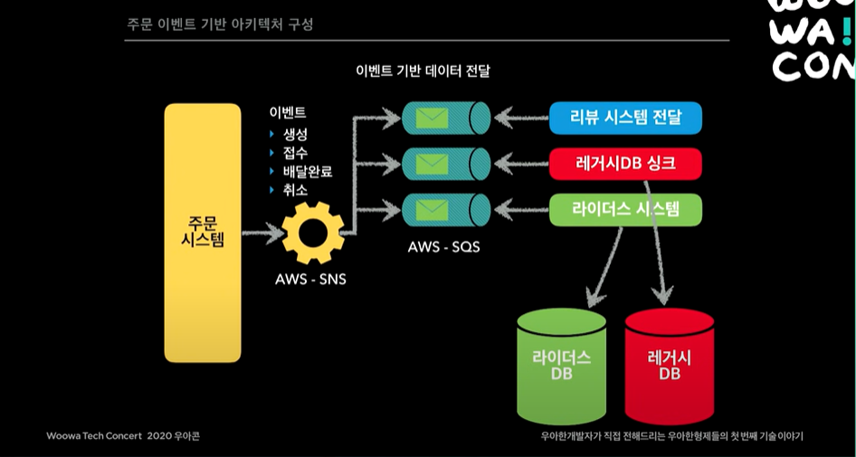

# 배달의민족 마이크로 서비스 여행기

강의주소 : https://www.youtube.com/watch?v=BnS6343GTkY

최초 배달의민족 서비스는 PHP와 다수의 프로시저 함수로 되어 있었다.  
IDC서버를 사용할 때였고, 트레픽이 한 번에 몰리는 이벤트를 계획하더라도 서버 증설을 하루만에 할 수가 없기에, 문제가 됐었다.

~~프로시저란?~~

IDC를 AWS 인프라로 이전하기 시작하고 이를통해 서버 증설이 쉬워졌다.

도메인 기반의 아키텍쳐는 하나의 서비스가 완벽하게 독립적일 수는 없었다.  
서버가 죽으면 연쇄적으로 피해가 갔다.  
배민은 요청을 놓치지 않기 위해 이벤트 기반의 아키텍쳐를 택했다.

Que를 쌓아놓고 순차적으로 하나씩 컨슘해서 API를 처리한다.

이 시스템의 장점은, 시스템이 죽어도, Que는 쌓이기 때문에
시스템이 복구되면 쌓였던 Que들을 처리할 수 있다.

## 이벤트 전파와 동기화의 장점

- 최종적 일관성
- 데이터는 언젠간 다 맞춰진다.
- 데이터 싱크 1 ~ 3초
- 문제 발생시 해당 시스템이 이벤트만 재발행
- 대부분 Zero-Payload 방식 사용

## 데이터 저장소

- 조회 (고성능)

  - DynamoDB, MongoDB, Redis(cache)
  - ElasticSearch

- 명령 (안정성)
  - 오로라DB(RDB)

마이크로 서비스를 꼭 해야 하나요?
시스템의 규모,
트래픽,
사람의 규모가 모두 가능해야 마이크로서비스를 할 수 있다.

테이블 Join하나로 끝날 걸 데이터 싱크하면 비용이 10배이상 드는데,  
비용을 부담할 가치가 있는 것이냐가 가장 중요하다.

결론 : 필요할 때 마이크로서비스를 도입하자
