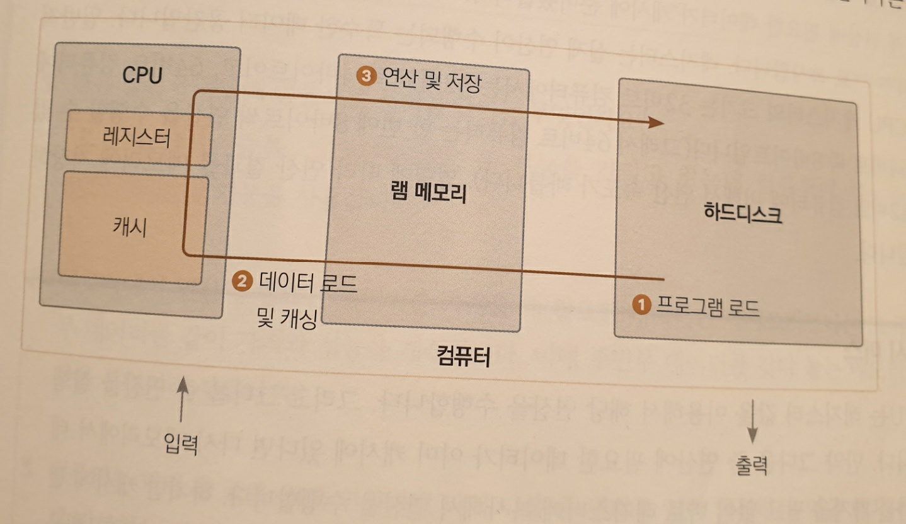
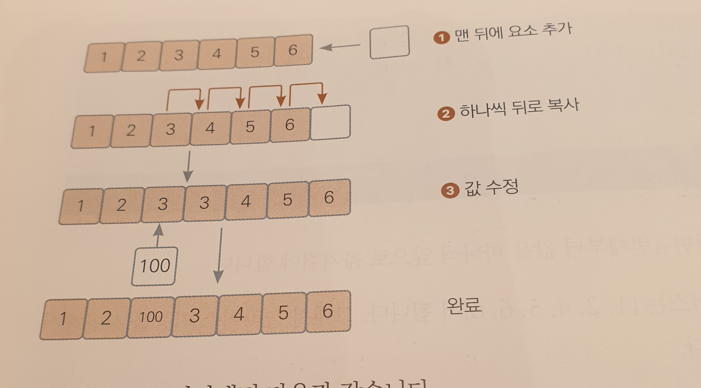
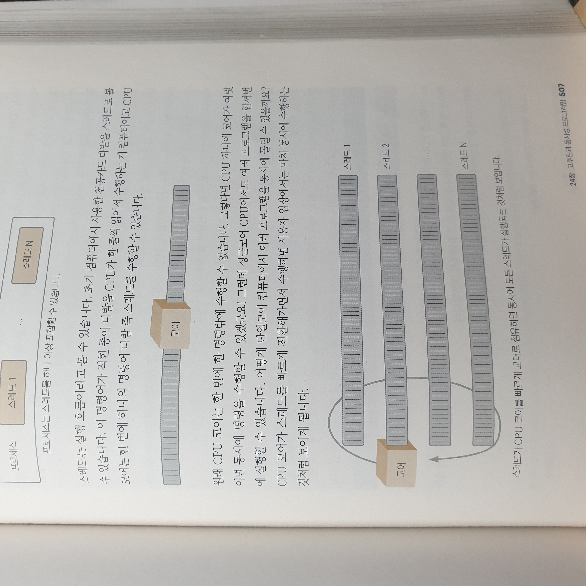

- [1. 컴퓨터 원리](#1-컴퓨터-원리)
  - [1.1. 비트의 탄생과 트랜지스터](#11-비트의-탄생과-트랜지스터)
    - [1.1.1. 트랜지스터와 0과 1](#111-트랜지스터와-0과-1)
    - [1.1.2. 2진수](#112-2진수)
  - [1.2. 트랜지스터에서 계산기로](#12-트랜지스터에서-계산기로)
    - [1.2.1. 논리 소자와 트랜지스터](#121-논리-소자와-트랜지스터)
    - [1.2.2. 논리 소자로 사칙연산](#122-논리-소자로-사칙연산)
  - [1.3. 계산기에서 컴퓨터로](#13-계산기에서-컴퓨터로)
    - [1.3.1. 최초의 상상속 컴퓨터 : 튜링 머신](#131-최초의-상상속-컴퓨터--튜링-머신)
    - [1.3.2. 컴퓨터의 완성 : 폰 노이만 구조](#132-컴퓨터의-완성--폰-노이만-구조)
  - [1.4. 컴퓨터 동작 원리](#14-컴퓨터-동작-원리)
- [2. 프로그래밍 언어](#2-프로그래밍-언어)
  - [2.1. 초창기 프로그래밍 언어](#21-초창기-프로그래밍-언어)
  - [2.2. 어셈블리어의 등장](#22-어셈블리어의-등장)
  - [2.3. 고수준 언어의 등장](#23-고수준-언어의-등장)
    - [2.3.1. 고수준 코드가 실행되기 까지](#231-고수준-코드가-실행되기-까지)
  - [2.4. 프로그래밍 언어의 구분](#24-프로그래밍-언어의-구분)
    - [2.4.1. 정적 컴파일 언어 vs 동적 컴파일 언어](#241-정적-컴파일-언어-vs-동적-컴파일-언어)
    - [2.4.2. 약타입 언어 vs 강타입 언어](#242-약타입-언어-vs-강타입-언어)
    - [2.4.3. 가비지 컬렉터 유무](#243-가비지-컬렉터-유무)
- [3. Hello go world](#3-hello-go-world)
  - [3.1. Go의 역사](#31-go의-역사)
  - [3.2. Go의 특징](#32-go의-특징)
  - [3.3. 코드가 실행되기까지.](#33-코드가-실행되기까지)
  - [3.4. Hello go world](#34-hello-go-world)
- [4. 변수](#4-변수)
  - [4.1. 변수란?](#41-변수란)
  - [4.2. 변수 선언](#42-변수-선언)
  - [4.3. 변수에 대해 더 알아보기](#43-변수에-대해-더-알아보기)
    - [4.3.1. 변수의 4가지 속성](#431-변수의-4가지-속성)
    - [4.3.2. 변수는 이름을 가지고 있다.](#432-변수는-이름을-가지고-있다)
    - [4.3.3. 변수는 타입을 가지고 있다.](#433-변수는-타입을-가지고-있다)
  - [4.4. 변수 선언의 다른형태](#44-변수-선언의-다른형태)
  - [4.5. 타입 변환](#45-타입-변환)
  - [4.6. 변수의 범위](#46-변수의-범위)
  - [4.7. 숫자 표현](#47-숫자-표현)
    - [4.7.1. 정수 표현](#471-정수-표현)
    - [4.7.2. 실수의 표현](#472-실수의-표현)
- [5. fmt패키지를 이용한 표준 입출력](#5-fmt패키지를-이용한-표준-입출력)
  - [5.1. 표준 입출력](#51-표준-입출력)
    - [5.1.1. fmt 패키지](#511-fmt-패키지)
    - [5.1.2. 서식문자.](#512-서식문자)
    - [5.1.3. 최소 출력 너비 지정](#513-최소-출력-너비-지정)
    - [5.1.4. 실수 소수점 이하 자리수](#514-실수-소수점-이하-자리수)
    - [5.1.5. 특수문자](#515-특수문자)
  - [5.2. 표준입력](#52-표준입력)
    - [5.2.2. Scan()](#522-scan)
    - [5.2.3. Scanf()](#523-scanf)
    - [5.2.4. Scanln()](#524-scanln)
  - [5.3. 키보드 입력과 Scan()함수의 동작 원리](#53-키보드-입력과-scan함수의-동작-원리)
- [6. 연산자](#6-연산자)
  - [6.1. 산술연산자](#61-산술연산자)
    - [6.1.1. 연산의 결과 타입](#611-연산의-결과-타입)
    - [6.1.2. 비트 연산자](#612-비트-연산자)
    - [6.1.3. 시프트 연산자](#613-시프트-연산자)
  - [6.2. 비교 연산자](#62-비교-연산자)
    - [6.2.1. 정수 오버플로](#621-정수-오버플로)
    - [6.2.2. 정수 언더플로](#622-정수-언더플로)
    - [6.2.3. float 비교 연산](#623-float-비교-연산)
  - [6.3. 실수 오차](#63-실수-오차)
    - [6.3.1. 작은 오차 무시하기](#631-작은-오차-무시하기)
    - [6.3.2. 오차를 없애는 더 나은 방법](#632-오차를-없애는-더-나은-방법)
  - [6.4. 논리연산자](#64-논리연산자)
  - [6.5. 대입연산자](#65-대입연산자)
    - [6.5.2. 복합 대입 연산자](#652-복합-대입-연산자)
    - [6.5.3. 증감 연산자](#653-증감-연산자)
- [7. 함수](#7-함수)
  - [7.1. 함수정의](#71-함수정의)
  - [7.2. 함수를 호출하면 생기는 일](#72-함수를-호출하면-생기는-일)
  - [7.3. 함수는 왜 쓰나?](#73-함수는-왜-쓰나)
- [8. 상수](#8-상수)
  - [8.1. 상수 선언](#81-상수-선언)
  - [8.2.3. iota로 간편하게 열거값 사용하기.](#823-iota로-간편하게-열거값-사용하기)
- [9. if문](#9-if문)
  - [9.2.1. 쇼트서킷](#921-쇼트서킷)
- [10. switch문](#10-switch문)
  - [10.2. switch문을 언제 사용하는가?](#102-switch문을-언제-사용하는가)
  - [10.3.1. 한 번에 여러 값 비교](#1031-한-번에-여러-값-비교)
  - [10.3.2. 조건 문 비교](#1032-조건-문-비교)
  - [10.3.3. switch 초기문](#1033-switch-초기문)
  - [10.5. break와 fallthrough 키워드](#105-break와-fallthrough-키워드)
  - [11. for문](#11-for문)
  - [12. 배열](#12-배열)
  - [12.3. 배열은 연속된 메모리](#123-배열은-연속된-메모리)
  - [12.4 다중배열](#124-다중배열)
- [13. 구조체](#13-구조체)
  - [13.1. 선언 및 기본 사용](#131-선언-및-기본-사용)
  - [13.2. 구조체 변수 초기화](#132-구조체-변수-초기화)
    - [13.2.1. 초깃값 생략](#1321-초깃값-생략)
    - [13.2.2. 모든 필드 초기화](#1322-모든-필드-초기화)
  - [13.3. 구조체를 포함하는 구조체](#133-구조체를-포함하는-구조체)
    - [13.3.2. 포함된 필드 방식](#1332-포함된-필드-방식)
  - [13.4. 구조체 크기](#134-구조체-크기)
    - [13.4.1. 구조체 값 복사](#1341-구조체-값-복사)
    - [13.4.2. 필드 배치 순서에 따른 구조체 크기 변화](#1342-필드-배치-순서에-따른-구조체-크기-변화)
    - [13.4.3. 메모리 정렬](#1343-메모리-정렬)
    - [13.4.4. 메모리 패딩을 고려한 필드 배치 방법](#1344-메모리-패딩을-고려한-필드-배치-방법)
  - [13.5. 프로그래밍에서 구조체의 역할](#135-프로그래밍에서-구조체의-역할)
- [14. 포인터](#14-포인터)
  - [14.1. 포인터란?](#141-포인터란)
    - [14.1.1 포인터 변수 선언](#1411-포인터-변수-선언)
    - [14.1.3. 포인터의 기본값 nil](#1413-포인터의-기본값-nil)
  - [14.2. 포인터는 왜 쓰나?](#142-포인터는-왜-쓰나)
    - [14.2.1. Data 구조체를 생성해 포인터 변수 초기화하기.](#1421-data-구조체를-생성해-포인터-변수-초기화하기)
  - [14.3. 인스턴스.](#143-인스턴스)
    - [14.3.1. 인스턴스는 데이터의 실체다.](#1431-인스턴스는-데이터의-실체다)
    - [14.3.2. new() 내장함수](#1432-new-내장함수)
    - [14.3.3. 인스턴스는 언제 사라지나](#1433-인스턴스는-언제-사라지나)
  - [14.4. 스택 메모리와 힙 메모리](#144-스택-메모리와-힙-메모리)
- [15. 문자열](#15-문자열)
    - [15.1.2. rune 타입으로 한 문자 담기](#1512-rune-타입으로-한-문자-담기)
    - [15.1.3. len()으로 문자열 크기 알아내기](#1513-len으로-문자열-크기-알아내기)
    - [15.1.4. \[\]rune타입 변환으로 글자 수 알아내기](#1514-rune타입-변환으로-글자-수-알아내기)
    - [15.2.3. range키워드를 이용해 한 글자씩 순회하기](#1523-range키워드를-이용해-한-글자씩-순회하기)
  - [15.4. 문자열 구조](#154-문자열-구조)
    - [15.4.1. string구조 알아보기](#1541-string구조-알아보기)
  - [15.5. 문자열은 불변이다.](#155-문자열은-불변이다)
- [16. 패키지](#16-패키지)
- [18. 슬라이스](#18-슬라이스)
    - [18.2.2. 슬라이스와 배열의 동작 차이](#1822-슬라이스와-배열의-동작-차이)
    - [18.2.3. 동작 차이의 원인](#1823-동작-차이의-원인)
  - [18.3. 슬라이싱](#183-슬라이싱)
  - [18.4. 유용한 슬라이싱 기능 활용된다](#184-유용한-슬라이싱-기능-활용된다)
    - [18.4.2. 요소 삭제](#1842-요소-삭제)
    - [18.4.3. 요소 추가](#1843-요소-추가)
  - [18.5. 슬라이스 정렬](#185-슬라이스-정렬)
    - [18.5.1. int 슬라이스 정렬](#1851-int-슬라이스-정렬)
    - [18.5.2. 구조체 슬라이스 정렬](#1852-구조체-슬라이스-정렬)
- [19. 메서드](#19-메서드)
  - [19.1. 메서드 선언](#191-메서드-선언)
  - [19.2. 메서드는 왜 필요한가?](#192-메서드는-왜-필요한가)
    - [19.2.1. 객체지향 : 절차 중심에서 관계 중심으로 변화.](#1921-객체지향--절차-중심에서-관계-중심으로-변화)
  - [19.3. 포인터 메서드 vs 값 타입 메서드](#193-포인터-메서드-vs-값-타입-메서드)
- [20. 인터페이스](#20-인터페이스)
  - [20.2. 인터페이스 왜 쓰나?](#202-인터페이스-왜-쓰나)
  - [20.2.1. 추상화 계층](#2021-추상화-계층)
  - [20.3. 덕 타이핑](#203-덕-타이핑)
    - [20.3.1. 서비스 사용자 중심 코딩](#2031-서비스-사용자-중심-코딩)
  - [20.4. 인터페이스 기능 더 알기](#204-인터페이스-기능-더-알기)
    - [20.4.1. 인터페이스를 포함하는 인터페이스](#2041-인터페이스를-포함하는-인터페이스)
    - [20.4.2. 빈 인터페이스 interface{}를 인수로 받기](#2042-빈-인터페이스-interface를-인수로-받기)
    - [20.4.3. 인터페이스 기본값 nil](#2043-인터페이스-기본값-nil)
  - [20.5. 인터페이스 변환하기](#205-인터페이스-변환하기)
    - [20.5.1. 구체화된 다른 타입으로 타입 변환하기](#2051-구체화된-다른-타입으로-타입-변환하기)
- [21. 함수 고급편](#21-함수-고급편)
  - [21.1. 가변 인수 함수](#211-가변-인수-함수)
  - [21.2 defer](#212-defer)
  - [21.3. 함수 타입 변수](#213-함수-타입-변수)
  - [21.4. 함수 리터럴](#214-함수-리터럴)
- [22. 자료구조](#22-자료구조)
  - [22.1. 리스트](#221-리스트)
    - [22.1.1. 포인터로 연결된 요소](#2211-포인터로-연결된-요소)
    - [22.1.2. 리스트 기본 사용법](#2212-리스트-기본-사용법)
  - [22.1.3. 배열 vs 리스트](#2213-배열-vs-리스트)
    - [22.1.4. 큐 구현하기](#2214-큐-구현하기)
    - [22.1.5. 스택 구현하기](#2215-스택-구현하기)
  - [22.2. 링](#222-링)
    - [22.2.1. 링은 언제 쓸까?](#2221-링은-언제-쓸까)
  - [22.3. 맵](#223-맵)
- [23. 에러](#23-에러)
  - [23.1. 에러 반환](#231-에러-반환)
    - [23.1.1. 사용자 에러 반환](#2311-사용자-에러-반환)
  - [23.2. 에러타입](#232-에러타입)
  - [23.3. 패닉](#233-패닉)
    - [23.3.2. 패닉 전파 그리고 복구](#2332-패닉-전파-그리고-복구)
    - [23.3.3. recover() 결과](#2333-recover-결과)
- [24. 고루틴과 동시성 프로그래밍](#24-고루틴과-동시성-프로그래밍)
  - [24.1. 스레드란?](#241-스레드란)
    - [24.1.1. 컨텍스트 스위칭 비용](#2411-컨텍스트-스위칭-비용)
  - [24.2. 고루틴 사용](#242-고루틴-사용)
    - [24.2.1 서브 고루틴이 종료될 때까지 기다리기](#2421-서브-고루틴이-종료될-때까지-기다리기)
  - [24.3. 고루틴 동작 방법](#243-고루틴-동작-방법)
  - [24.5. 뮤텍스를 이용한 동시성 문제 해결](#245-뮤텍스를-이용한-동시성-문제-해결)
  - [24.6 뮤텍스와 데드락](#246-뮤텍스와-데드락)
- [25. 채널과 컨텍스트](#25-채널과-컨텍스트)
    - [25.1.2. 채널에 데이터 넣기](#2512-채널에-데이터-넣기)
    - [25.1.3. 채널에서 데이터 빼기](#2513-채널에서-데이터-빼기)
    - [25.1.4. 채널크기](#2514-채널크기)
    - [25.1.5. 버퍼를 가진 채널](#2515-버퍼를-가진-채널)
    - [25.1.7. select 문](#2517-select-문)
    - [25.1.8. 일정 간격으로 실행](#2518-일정-간격으로-실행)
    - [25.1.9. 채널로 생산자 소비자 패턴 구현하기](#2519-채널로-생산자-소비자-패턴-구현하기)
  - [25.2. 컨텍스트 사용하기](#252-컨텍스트-사용하기)
    - [25.2.1. 작업 취소가 가능한 컨텍스트](#2521-작업-취소가-가능한-컨텍스트)
    - [25.2.3. 특정 값을 설정한 컨텍스트](#2523-특정-값을-설정한-컨텍스트)
- [27.1 객체지향 설계 5가지 원칙 SOLID](#271-객체지향-설계-5가지-원칙-solid)
  - [27.2. 단일 책임 원칙](#272-단일-책임-원칙)
  - [27.3. 개방-폐쇄 원칙](#273-개방-폐쇄-원칙)
  - [27.4. 리스코프 치환 원칙](#274-리스코프-치환-원칙)
  - [27.5. 인터페이스 분리 원칙](#275-인터페이스-분리-원칙)
  - [27.6. 의존 관계 역전 원칙](#276-의존-관계-역전-원칙)
- [28. 테스트](#28-테스트)
- [B. 생각하는 프로그래밍](#b-생각하는-프로그래밍)
  - [B.1. Go는 객체지향 언어인가?](#b1-go는-객체지향-언어인가)
    - [B.1.1. 상속](#b11-상속)
    - [B.1.2. 메서드 오버라이딩](#b12-메서드-오버라이딩)
    - [B.4. 값 타입을 쓸 것인가? 포인터를 쓸 것인가?](#b4-값-타입을-쓸-것인가-포인터를-쓸-것인가)

# 1. 컴퓨터 원리

컴퓨터는 매우 단순한 기계다.

아는 것이라고는 0과 1뿐이다.

다만 매우 빠르게 수행할 뿐이다.

컴퓨터는 트랜지스터를 기본 소자로 사용해 발전했다.

1945년 발표된 폰 노이만의 컴퓨터 구조는 현재 컴퓨터에서도 활용된다.

## 1.1. 비트의 탄생과 트랜지스터

트랜지스터 : 연산을 수행하는 가장 기본이 되는 소자.
컴퓨터는 수많은 트랜지스터를 사용해 연산한다.

트랜지스터는 성질이 다른 2가지 실리콘(규소), N형과 P형을 겹쳐 만든다.  
NPN 트랜지스터는 N형 실리콘 사이에 P형을 넣어서 만든다.
가운데 P형을 베이스, 양쪽N을 왼쪽부터 이미터, 콜렉터라고 부른다.
Emit (방출하다), Collect(수집하다.)

### 1.1.1. 트랜지스터와 0과 1

베이스 부분 P에 전압 INPUT = 전류가 흐르고
전압을 가하지 않으면 = 전류가 흐르지 않는다.

이게 마치 스위치를 켜고 끄는 것과 같아서 스위치 기능이라고 부른다.

트랜지스터를 이용해서 0과 1을 표현할 수 있다.  
0과 1 둘 중 하나의 숫자값을 나타내는 공간을 1비트라고 한다.

### 1.1.2. 2진수

숫자 2개를 사용해서 수를 표현하면 2진수.

프로그래머 계산기에서 DEC는 10진수, BIN은 2진수를 의미한다.

Decimal = Dec = 10진수
Binary = Bin = 2진수

2진법 11011이라는 숫자를 표현하기 위해서는 트랜지스터가 5개 필요하다.

트랜지스터 하나로 2진법으로 한 자릿수를 표현하는 것을 1비트bit라고 한다.

1byte = 8bit
1KB = 1024byte
1MB = 1024KB
1GB = 1024MB
1TB = 1024GB
1PB = 1024TB (페타바이트)
1ZB = 1024PB (제타바이트)

## 1.2. 트랜지스터에서 계산기로

### 1.2.1. 논리 소자와 트랜지스터

AND OR XOR NOT

- AND
  두 입력이 모두 1이면 1, 하나라도 0이면 0

- OR

  두 입력이 하나라도 1이면 1 모두 0이면 0

- XOR

두 입력이 서로 다르면 1 같다면 0

- NOT

입력이 하나고 0이면 1을, 1이면 0을 반환.

**AND 소자 구조**

AND 소자면

트랜지스터에서 전류를 흘려 보낼 때, 모든 입력이 1이여야 1이되는 구조를 가졌다.

### 1.2.2. 논리 소자로 사칙연산

## 1.3. 계산기에서 컴퓨터로

트랜지스터를 이용해서 계산기를 만드는 방법을 살펴봤다.  
계산기와 컴퓨터는 엄연히 다르다.  
어떻게 컴퓨터에서 계산기로 발전했는지 알아보자

### 1.3.1. 최초의 상상속 컴퓨터 : 튜링 머신

앨런 튜링이 컴퓨터가 존재하기 전에 상상으로 구현한 기계 ( 컴퓨터)  
튜링머신에 기초하여 컴퓨터가 만들어진다.

영국의 천재 과학자 앨런 튜링 독일의 첨단 암호화 장치인 에니그마를 해독하여 전쟁 승리를 이끔

https://ko.wikipedia.org/wiki 참조

기계는 현재 칸을 읽을 수 있고 칸을 자유자재로 이동할 수 있다.
기계를 조정해 계산을 수행한다.

### 1.3.2. 컴퓨터의 완성 : 폰 노이만 구조


https://m.hanbit.co.kr/channel/category/category_view.html?cms_code=CMS4316945379 참조

폰 노이만의 구조는 현대 컴퓨터에서 모두 사용하는 기본구조다.

폰 노이만의 구조에서 명령은 중앙처리장치인 CPU에서 수행된다.  
프로그램이란 메모리에 올라가서 CPU에 명령어를 순차적으로 제공하는 명령어 묶음이다.

실제로 초창기 컴퓨터는 종이 카드에 구멍을 뚫어서 사용하는 천공카드 다발을 사용해서 컴퓨터에 프로그램 명령어들을 제공했다.

컴퓨터

[ 한 줄의 명령을 읽는다. -> 명령을 수행한다. -> 다음줄로 진전한다 ] 반복

프로그래머는 프로그래밍 언어를 사용하여 어떤 연산을 어떤 순서로 실행할지 정의하는 사람.

## 1.4. 컴퓨터 동작 원리

메모리는 휘발성과 비 휘발성으로 나뉜다.  
램 메모리, 하드디스크다.  
램은 하드보다 빠르지만, 전원 공급이 중단되면 데이터가 날라간다.  
하드디스크는 전원 공급이 중단되도 데이터가 사라지지 않는다.



1. 프로그램 로드

프로그램이 실행 -> <운영체제> 실행 파일을 메모리에 복사.(== load)
이유 : 속도 메모리 > 하드
프로그램 첫 줄부터 한 줄씩 코드를 실행.

2. 데이터 로드 및 캐싱

모든 명령은 CPU에 의해 실행된다.

CPU가 연산을 처리하려면 연산에 필요한 데이터를 가져와야 한다.  
이를 위해 CPU내부에는 캐시라는 별도 메모리 공간이 존재한다.  
캐시는 연산에 필요한 데이터를 보관하는 임시 저장소다.  
램 보다 적은 공간이지만 훨씬 빠르다. (이유 추측 CPU로부터 데이터를 받기 위한 절차가 램보다 더 적기 때문에.)

먼저 메모리에서 연산에 피요한 데이터를 캐시로 복사.  
복사할 때 정확히 연산에 필요한 부분만 복사하는 게 아니라, 근처 데이터도 같이 복사한다.  
다음 연산에 필요한 데이터는 이전 연산에 사용된 데이터와 연속되어 있는 경우가 많기 때문.  
**캐시를 사용할 경우 램 메모리를 이용하는 횟수가 줄어 성능향상.**

3. 연산 및 저장

연산에 필요한 데이터가 캐시에 준비됐다.  
CPU는 연산에 사용할 데이터를 레지스터(register)에 복사한다.  
레지스터는 실제 연산이 수행되는 특수한 데이터 공간이다.

CPU의 레지스터 크기 = 32비트 컴퓨터에서는 32비트 즉 4바이트  
64비트 컴퓨터에서는 8바이트다.  
64비트 컴퓨터는 한 번에 8바이트씩 연산을 수행할 수 있다.  
명령에 따라 연산 결과를 메모리에 저장하기도 한다.

> 캐시미스
>
> CPU는 레지스터 값을 이용해 연산을 수행한다.
> 그리고 그 다음 줄 연산을 실행한다.
> 그 다음 줄 연산에 필요한 데이터가 이미 캐시에 있으면  
> 다시 메모리에서 데이터를 가저올 필요가 없다.  
> 캐시에 없다면 캐시를 비우고 메모리에서 연산에 필요한 데이터를 복사해온다.  
> 이를 캐시미스 (cahce miss)라 부른다.
> 캐시미스가 발생하지 않도록 코딩을 한다면 성능상 이득을 얻을 수 있다.
> **관련 데이터를 연속된 메모리 공간에 저장하면 캐시미스가 덜 발생할 수 있다.**

문제

Q. 16GB짜리 램 메모리 카드가 있다면 이 카드 안에 트랜지스터가 몇 개가 들어 있을까요?

A. 16 x 1024 x 1024 x 1024 x 8

# 2. 프로그래밍 언어

프로그래밍 언어란?

프로그램을 만드는 표현 규약이다.  
컴퓨터는 인간 언어로 된 명령을 이해할 수 없기에, 기계가 알아 들을 수 있는 언어가 필요한데, 이를 기게어라고 부른다.  
기계어는 사람이 해독하기에는 너무 힘들다.

기게어와 인간 언어의 중간에 위치하는 고수준 프로그래밍 언어를 개발했다.

## 2.1. 초창기 프로그래밍 언어

컴퓨터가 알 수 있는 건 오직 0과 1뿐이다.

예를들어 3과4를 더하라는 의미로 "ADD 3 4"명령을 내리고 싶다고 가정.  
가령 ADD를 011로 표현하자는 규칙을 정하는 거다.  
입력 011이 들어오면 내부 회로에서 가산기로 연결하는 스위치를 켜서  
가산기가 수행되도록 만드는 거다.  
이렇게 수행할 명령어를 나타내는 부호를 오퍼레이션 코드 OP라고 부른다.

0011(ADD) 0011(3) 0100(4)

## 2.2. 어셈블리어의 등장

"ADD 3 4" = 어셈블리언어

어셈블리의 사전적 정의 : 여러 개의 부속품을 결합하여 하나의 장치 혹은 구조로 만드는 과정.

연산자 뒤에 숫자 2개를 쓰는 법칙이다.  
기계어와 1:1 매칭이 되기 때문에 매우 빠르고 칩셋마다 명령을 새로 익혀야 한다는 불편함이 존재했다. 어셈블리어는 기계 장치에 직접 코딩하는 임베디드 프로그래밍에 많이 사용된다.

## 2.3. 고수준 언어의 등장

어셈블리언어는 단순한 프로그램에도 코딩 양이 많았기 때문에 불편했다.  
그래서 전체 동작을 이해하기 힘들고 버그 발생 확률도 높았다.

고수준 언어는 높은 가독성, 생산성, 유연한 이식성을 제공한다.

### 2.3.1. 고수준 코드가 실행되기 까지

어떤 프로그래밍 언어로 작성하든 컴퓨터가 명령을 내리면 결국 기계어로 변환되어야 한다.

어셈블리 언어는 1:1 매칭이기 때문에 변환 과정이 매우 빠르고 쉽다.  
고수준 언어는 기계어로 바로 변환될 수 없기 때문에 별도의 프로그램을 사용해야 한다. 이를 컴파일러라고 칭한다.

고수준언어 -> 컴파일 -> 기계어

## 2.4. 프로그래밍 언어의 구분

### 2.4.1. 정적 컴파일 언어 vs 동적 컴파일 언어

미리 컴파일을 해두면 = 정적 컴파일 언어
사용할 때 컴파일하면 = 동적 컴파일 언어

**정적 컴파일 언어**

기계어로 미리 변환해 둔 파일을 실행파일이라고 한다.  
윈도우에서는 .exe가 미리 기계어로 변환된 실행파일이다.  
실행파일 === 기계어 코드
실행할 때 변환 과정이 필요 없어서 빠르고, 타입 에러를 컴파일 시점에서 발견할 수 있어서 타입 안정성이 뛰어나다.

**동적 컴파일 언어**

실행 시점 (run time)에 기계어로 변환하는 방식의 언어를 동적 컴파일 언어라고 한다.

동적 컴파일 언어는 속도도 느린데 왜 개발 됐을까요?

정적 컴파일 언어의 단점을 보완하기 위해.

칩셋과 운영체제마다 0과1로된 바이너리 코드를 표현하는 방식이 다르다.  
기계어로 변환할 때 각 칩셋에 맞게 해줘야 한다.

64,32비트인지 ARM인지 intel기반인지, 운영체제가 뭔지에 따라 달라진다.  
다양한 실행환경을 지원하려면 그만큼 빌드를 많이 해야 한다.

동적 컴파일 언어는 이런 불편함 없이 하나의 코드로 모든 플랫폼에서 실행된다.  
프로그램 실행 시점에 환경에 맞는 기계어로 변환되기 때문이다.

속도대신 범용성을 얻었다.

GO는 정적 컴파일 언어기 때문에 각 플랫폼에 맞는 실행환경을 따로 만들어줘야 한다. 하지만 GO는 내부 환경 변수만 바꿔서 다양한 플랫폼에 맞도록 실행 파일을 만들 수 있어서 비교적 쉽게 대응할 수 있다.

### 2.4.2. 약타입 언어 vs 강타입 언어

12와 "12"는 엄연히 다르다. 12 +"12"를 할 때 1212, 14, 에러 등 다양한 방식으로 해석한다.  
타입 간 연산에 관대한 언어를 약타입, 반대를 강타입언어라고 부른다.

Go는 다른 강 타입 언어에서 지원하는 자동 타입 변환까지도 지원하지 않는 최강타입 언어다.

### 2.4.3. 가비지 컬렉터 유무

가바지 컬렉터 = 쓰레기 청소부  
메모리에서 불 필요한 영역을 치워준다.  
가비지 컬렉터가 없는 언어는 프로그래머가 메모리 할당과 해제를 책임져야 한다.

가비지 컬렉터가 있으면 메모리를 자동으로 해주기 때문에 메모리 관련 문제가 줄어든다는 장점이 존재하지만, 메모리 청소에 CPU 성능을 사용한다는 문제가 있다. 그래서 가비지 컬렉터가 없는 경우 더 빠르다.

GO는 가비지컬렉터가 있다. 매우 발전된 형태의 가비지 컬렉터를 가졌다. 그래서 가지비컬렉터 언어 중에서는 성능이 매우 빠르다.

# 3. Hello go world

- 심플한 문법구조 쉽게 배운다.
- 모던 프로그래밍 기법 다수 지원, 강력한 성능
- 범용 언어기 때문에 어떤 용도로도 가능하지만, 주로 백엔드 서버와 시스템 프로그래밍에 사용된다. 강력한 성능 때문이다.
- 동시성 지원

## 3.1. Go의 역사

- 2009년 발표

## 3.2. Go의 특징

- 클래스 X
- 상속 X
- 메서드 O
- 인터페이스 O
- 익명 함수 O
- 가비지 컬렉터 O
- 포인터 O
- 제네릭 프로그래밍 X
- 네임스페이스 X

## 3.3. 코드가 실행되기까지.

1. 폴더생성

Go언어에서 모든 코드는 패키지 단위로 작성된다.  
같은 폴더에 위치한 .go파일은 모두 같은 패키지에 포함되고, 패키지명으로 폴더명을 사용한다.

폴더가 다르면 패키지도 달라진다.

2. 파일생성

3. Go 모듈생성

1.16버전 이후로 Go모듈이 기본적으로 적용된다. Go코드는 빌드하기 전에 모듈을 생성해야 한다.

```bash
go mod inti goproject/hello
```

go.mod 파일에는 모듈명 go버전 필요한 패키지 목록 담겨져 있음.

4. 빌드

```bash
GOOS=linux GoARCH=amd64 go buoild
```

## 3.4. Hello go world

```go
package main
```

Go 언어의 모든 코드는 반드시 패키지 선언으로 시작해야 한다.  
main패키지는 프로그램 시작점을 포함하는 특별한 패키지.

fmt는 표준 입출력을 다루는 내장 패키지

주석 // /\* \*/ 지원

Println 문자열을 출력하는 함수.

# 4. 변수

변수란 값을 저장하는 메모리 상의 공간  
값에 접근해 값을 변경하는 데에 사용  
변수는 이름, 값, 타입, 주소 속성을 갖는다.  
변수 간 값의 전달은 항상 복사로 일어난다.

1. 변수는 이름이 있다.
2. 변수는 값이 있다.
3. 변수틑 타입이 있다.
4. 변수는 메모리 주소를 나타낸다.

변수를 사용하면 메모리 공간에 이름을 부여하여 쉽고 효과적으로 메모리를 사용할 수 있다.

## 4.1. 변수란?

프로그래밍에서 변수는 값을 저장하는 메모리공간을 가리키는 이름.

컴퓨터 입장에서 프로그램은 '메모리에 있는 데이터를 언제 변경할지를 나타낸 문서'
따라서 메모리에 있는 데이터 조작은 프로그래밍에 있어 핵심. 변수를 이용하면 쉽고 효과적으로 메모리에 있는 데이터를 조작할 수 있다.

## 4.2. 변수 선언

변수를 사용하려면 먼저 변수를 선언해야 한다.  
변수 선언은 컴퓨터에게 값을 저장할 공간을 마련하라고 명령을 내리는 거다.  
이것을 메모리 할당이라고 한다.

```go
var a int = 10
```

```go
package main

import "fmt"

func main() {
  var minimumWage int = 10
  var workingHOur int = 20

  var income int = minimumWage * workingHour

  fmt.Println(minimunWage, workingHour, income)
}
```

정수 타입 변수 minimunWage와 workingHour를 선언하고 각각 10과 20을 대입한다.  
컴퓨터는 변수를 선언할 때

1. 정수 타입 데이터를 저장할 공간을 만든다
2. miniMunWage라고 지징
3. 값 10을 복사

이제 minimunWage라는 변수명을 이요해서 해당 공간에 접근할 수 있다.

## 4.3. 변수에 대해 더 알아보기

Go언어를 더 잘 이해하고 예기치 못한 버그 발생 없이 프로그래밍하려면 변수를 잘 알아야 한다.

### 4.3.1. 변수의 4가지 속성

- 이름 : 프로그래머는 이름을 통해 값이 저장된 메모리 공간에 손쉽게 접근할 수 있다.
- 값 : 변수가 가리키는 메모리 공간에 저장된 값이다.
- 타입 : 변숫값의 형태를 말한다.

### 4.3.2. 변수는 이름을 가지고 있다.

변수를 지을 때 첫글자는 반드시 \_나 문자열로 시작해야 한다.

firstName과 같은 형태를 사용한다.

### 4.3.3. 변수는 타입을 가지고 있다.

타입이 필요한 이유

- 타입은 공간의 크기를 나타낸다. 크기를 알아야지 메모리 주소에서 얼만큼 읽을지 결정할 수 있다. ( 타입을 알면 크기를 알 수 있다. )
- 컴퓨터가 데이터를 해석할 수 있다.

**숫자 타입**
부호 없는 정수 숫자 = uint
부호 있는 숫자 = int
실수 = float
뒤에 붙는 숫자는 비트 단위를 나타낸다.

**그 외 타입**

- 슬라이스 : 가변 길이 배열. 배열은 고정길이로 한 번 길이가 정해지면 바꿀 수 없는 반면 슬라이스는 늘이거나 줄일 수 있다.
- 구조체 : 필드(변수)의 집합 자료구조. 상관관계가 있는 데이터를 묶어놓을 때 사용한다.
- 포인터 : 메모리 주소를 값으로 갖는 타입 포인터를 이용해서 같은 메모리 공간을 가리키는 여러 변수를 만들 수 있다.
- 함수 : 함수를 가리키는 타입 다른말로 함수 포인터라고 한다. 사용할 함수를 동적(런타임에서)으로 바꿀 때 유용하다.
- 인터페이스 : 메서드 정의의 집합
- 맵 : key-value을 갖는 데이터를 저장해둔 자료구조, 키를 사용해 데이터를 찾는 데 특회된 자료구조,
- 채널 : 멀티스레드 환경에 특화된 큐 형태의 자료구조

## 4.4. 변수 선언의 다른형태

```go
package main

import "fmt"

func main() {
  var a int = 3 //기본 형태
  var b int // 초깃값 생략. 초깃값은 타입별 기본값으로 대체
  var c = 4 // 타입생략. 변수 타입은 우변 값의 타입이 됨
  d := 5 // 선언 대입문 := 을 사용해서 var 키워드와 타입 생략

}
```

타입을 생략하면 우변의 타입으로 좌변의 타입이 지정된다.  
정수는 int 실수는 float64가 기본이다.

값을 생략하면 각 타입별로 0, 0.0 fasle "" nil이 선언된다.

## 4.5. 타입 변환

**Go 언어에서는 연산이나 대입에서 타입이 다르면 에러가 발생한다.**

```go
a : = 3
var b float64 = 3.5

var c int = b // float64변수를 int에 대입 불가
d := a * b //다른타입인 int * float64안됨

var e int64 = 7
f := a * e // a 는 int타입 e는 int64타입을 같은 정수값이지만 타입이 달라서 연산 불가.
```

**int \* int64도 에러가 난다.**

같은 숫자 값이라도 타입이 다르면 연산이 안 되기 때문에 타입을 변환해서 연산을 해줘야 한다.
이것을 타입 변환이라고 한다. 타입 변환은 원하는 타입명을 적고
()로 변화시키고 싶은 변수를 묶어준다.

```go
package main

import "fmt"

func main() {
  a := 3 //int
  var b float64 = 3.5 // float

  var c int = int(b) // float64 -> int
  d := float64(a * c) // int -> float64

  var e int64 = 7
  f : = int64(d) * e //float64 -> int64

  var g int = int(b * 3) //float64 -. int
  var h int = int(b) * 3 // float 64 -> int g와 값이 다르다.
  fmt.Println(g, h, f)

}
```

실수 타입 -> 정수 타입 소숫점 이하가 없어진다.

큰 범위 -> 작은범위 값이 달라진다.

```go
package main

import "fmt"

func main () {
  var a int16 = 3456
  var c int8 = int8(a) // int 16 - > int8

  fmt.Println(a)
  fmt.Println(c) // int8인 c 출력
}
```

타입을 변환했더니 c값이 3456에서 -128로 변했다.
2바이트 정수 int16에서 1바이트 정수 int8로 변환할 때
상위 1바이트가 없어지기 때문.

## 4.6. 변수의 범위

변수는 자신이 속한 중괄호 {} 범위를 벗어나면 사라진다.

## 4.7. 숫자 표현

### 4.7.1. 정수 표현

15 를 2진법으로 변환하면 1111이다.
정수는 맨 앞에 부호가 오고 그 뒤로 2진법 값이 온다.
예를들어 15면 0 00001111 이런 식이다.
그렇다면 -15면 1 00001111일까? 아니다.

왜냐면 값이 0 일때는 음수 양수를 구분하지 않아야 하기 때문이다.

게다가 표현할 수 있는 숫자가 하나 줄어서 낭비가 발생한다.  
떄문에 컴퓨터에서 음수의 절댓값의 2의 보수로 표현한다.
2의 보수를 만드는 방법은 모든 1을 0으로 바꾸고 모든 0을 1로 바꾸고 1을 더하면 됨.

그러면 1 11110001 이 된다.

0 00001111
\+ 1 11110001
0 00000000으로 표현할 수 있겠다.

### 4.7.2. 실수의 표현

예를들어 1024.234는 0.1024234 \* 10의4승 으로 나타낼 수 있고,  
0.1024234e+04라고 쓰기도 한다. 1024234가 소수부이고 10의 승수인 4가 지수부다.

# 5. fmt패키지를 이용한 표준 입출력

## 5.1. 표준 입출력

프로그램과 사용자는 입출력을 통해서 상호작용을 한다.  
일반적으로 화면에 출력하고 키보드를 통해 입력받는다.  
입력은 키보드가 아닌 네트워크를 통해 받을 수도 있고 파일을 통해서도 가능하다.

표준 입출력을 사용하면 목적지에 상관없이 간편하게 입출력을 할 수 있다.  
fmt패키지를 사용한다.

### 5.1.1. fmt 패키지

표준 입출력 기능은 go 언어 기본 패키지인 fmt에서 제공한다.

Print() 합수 입력값들을 출력
Println() 함수 입력값들을 출력하고 개행
Printf() 서식에 맞도록 입력값들을 출력

### 5.1.2. 서식문자.

%d, %f, %s ,%v

%d = 10진수 정수값으로 출력 (정수 타입만 가능.)
%f = 지수 형태가 아닌 실숫값 그대로 출력한다. (실수 타입만 가능)
%s = 문자열
%q = 특수문자 기능을 동작하지 않고 문자열 그대로 출력
%T 데이터 타입 출력

### 5.1.3. 최소 출력 너비 지정

```go
package main

import "fmt"

func main(){
  var a = 123
  var b = 456
  var c = 123456789

  fmt.Printf("%5d", "%5d\n", a, b)
  fmt.Printf("%05d, %05d\n", a,b)
  fmt.Printf("%-5d, %-05d\n", a,b)
  fmt.Printf("%5d, %5d\n", c,c)
  fmt.Printf("%05d, %05d\n",c,c)
}
```

%-5d 왼쪽정렬 오른쪽 2칸 남음.
%05d 왼쪽 빈칸을 0으로 채움

최소 너비보다 긴 값을 출력할 땐 무시하고 전부 출력.

### 5.1.4. 실수 소수점 이하 자리수

%f : 실수를 출력한다 예를들어 %5.2f는 최소 너비 5칸에 소수점 이하값 2개를 출력한다
%g : 실수를 정수부와 소수점 이하 숫자를 포함해 출력 숫자를 제한한다.

### 5.1.5. 특수문자

\t 탭 삽입
\\\ \ 자체를 출력

```go
str := "Hello\tGo\t\tWorld\n\"Go\"is Awesome!\n"
fmt.Printf("%q", str) ==> 문자열 그대로 출력
```

## 5.2. 표준입력

Scan() 표준입력에서 값을 입력받습니다.
Scanf() 표준 입력에서 서식 형태로 값을 입력받습니다.
Scanln() 표준 입력에서 한 줄을 읽어서 값을 입력받습니다.

### 5.2.2. Scan()

Scan() 함수는 값을 채워넣을 변수들의 메모리 주소를 인수로 받는다.

```go
func main() {
  var a int
  var b int

  n,err := fmt.Scan(&a,&b)
}
```

### 5.2.3. Scanf()

Scanf는 함수 서식에 맞춘 입력을 받는다.

숫자 2개를 입력받는 예시

```go
var a int
var b int

n,err := fmt.Scanf("%d %d\n", &a, &b)

```

### 5.2.4. Scanln()

Scanln는 한 줄을 입력 받아서 인수로 돌아온 변수 메모리 주소에 값을 채운다.

Scan()과 다른 점은 마지막 입력값 이후 반드시 enter키로 입력을 종료해야 한다는 점이다.

```go
var a int
var b int

n,err := fmt.Scanln(&a, &b)
```

## 5.3. 키보드 입력과 Scan()함수의 동작 원리

사용자가 표준 입력 장치로 입력하면 입력 데이터는 컴퓨터 내부에 표준 입력스트림이라는 메모리 공간에 임시 저장된다. Scan()함수들은 그 표준 입력 스트림에서 값을 읽어서 입력값을 처리한다.

표준 입력 스트림에서 **스트림이란** 흐름이라는 뜻을 가진다.  
입력 데이터가 연속된 데이터 흐름 형태를 가지고 있다는 뜻이다.  
데이터가 A포인트에서 B포인트로 흘러간다고 해서 파이프라고 부르기도 한다.

hello4를 입력받으면

\n4 o l l e H 이런 형태로 저장된다.
왜냐면 가장 먼저 입력한 데이터부터 읽어오기 때문이다.

먼저 입력된 데이터가 먼저 읽히는 데이터 구조를 FIFO(First in First Out)라고 말한다.
표준 입력 스트림은 바로 FIFO구조를 가지고 있다.

# 6. 연산자

## 6.1. 산술연산자

### 6.1.1. 연산의 결과 타입

Go 언어에서 모든 연산자의 **각 항의 타입은 항상 같아야 한다.**
예를들어 정수와 실수를 서로 더하거나 뺼 수 없다.
타입 변환을 통해 타입을 같도록 맞춰준 다음에 연산을 해야 한다.

### 6.1.2. 비트 연산자

& | ^ ^& 비트 단위로 연산하는 비트 연산자다. 정수만 피연산자가 될 수 있다.
컴퓨터의 모든 값은 0과 1로 표현되고 이를 1비트라고 한다.

비트 연산자는 각 비트 단위로 연산을 수행한다. 그래서 비트 연산을 위해서는 먼저
정숫값을 2진수로 표현한 뒤 계산해야 한다.

**& ( AND 연산자 )**

A =1 B =1 일때만 A&B = 1

10 & 34 = 2

10 = 0000 1010
& 34 = 0010 0010
2 = 0000 0010

**| (OR 연산자)**

10 = 0000 1010
34 = 0000 0010

42 = 0010 1010

**^(XOR연산자)**

A ^B연산을 수행할 때 A와 B가 다르면 1이 된다.

**&^(비트 클리어 연산자)**

특정 비트를 0으로 바꾸는 연산자입니다.

10 &^ 2
^연산을 수행 한다 -> &연산을 수행한다.

0000 0010

1111 1101

0000 1010

0000 1000

### 6.1.3. 시프트 연산자

비트를 왼쪽 또는 오른쪽으로 당기는 연산자

**<<왼쪽시프트**

오른쪽 피연산자값 만큼 전체 비트를 왼쪽으로 밀어낸다.
이떄 비트가 이동되어 빈 자리는 0이 채워지고 자리수를 벗어난 비트는 버려진다.

```go
package main

import "fmt"

func main() {
  var x int8 = 4
  var y int8 = 64

  fmt.Printf("x:%08b x<<2: %08b x<<2: %d\n", x, x << 2, x << 2) // 16
  fmt.Printf("x:%08b x<<2: %08b x<<2: %d\n", y, y << 2, y << 2) // 0
}
```

1번의 값은 2의 승수와 같은 결과

2번의 값은 64는 2진수로 0100 0000
전체 비트를 왼쪽으로 2칸 밀면 0001 0000 0000 01이 두칸 밀려서 0이 된다.

승수를 구할 때 사용하기 좋다.

**>> 오른쪽시프트**
비트값을 오른쪽으로 민다.

00010000 x >> 2 0000100 16은 4가 된다. 4

## 6.2. 비교 연산자

### 6.2.1. 정수 오버플로

정수가 정수 타입의 범위를 벗어난 경우 값이 비정상으로 변화하는 현상을 오버플로라고 한다.

x가 정수타입일 떄 x < x+ 1 을 항상 만족하지 못할 수 있다.

```go
    fmt.Printf("%d < %d +1: %v\n", x, x, x < x + 1)
```

int8 은 -128 ~ 127까지다. 근데 +1을 해서
1000 0000 이 되어서 최상이비트가 0에서 1로 바뀌었다. -128이 되어버리기 때문에, false가 나오는 것이다.

### 6.2.2. 정수 언더플로

마찬가지로 가장 작은 값에서 -1 했을 때 가장 큰 값으로 바뀐다.

### 6.2.3. float 비교 연산

실수 연산에서

```go
var a float64 = 0.1
var b float64 = 0.2
var c float64 = 0.3

a + b == c  // false
a + b // 0.3000000000000004
```

## 6.3. 실수 오차

컴퓨터에서 실숫값을 표현할 때 지수부와 소수부로 나눠서 표현한다.
컴퓨터는 지수부와 소수부가 10진수 기준이 아니라 2진수 기준으로 되어 있습니다.

그래서 10진수 실수를 정확히 표현하기 어렵다.

0.375 = 0.3 + 0.07 + 0.005

1 \* 2 -2승 + 1 x 2 -3승

0.376은 2의 음의 승수료 표현하기 어렵다.

0.375에서 0.001 더한 값은 2의 승수값을 찾기가 어렵다.

그래서 0.375값은 float32 최대한 가깝게 표현하면
0.37599987125396....

이 문제를 어떻게 해결해야 할까요?

### 6.3.1. 작은 오차 무시하기

```go
func equal(a, b float64) bool {
  if a > b {
    if a -b <= epsilon {
      return true
    } else {
      return false
    } else {
      if b -a <= epsilon {
        return true
      } else {
        return false
      }
    }
  }
}
```

### 6.3.2. 오차를 없애는 더 나은 방법

## 6.4. 논리연산자

## 6.5. 대입연산자

a, b = 3, 4

### 6.5.2. 복합 대입 연산자

### 6.5.3. 증감 연산자

요약

실수 타입은 서로 값이 같은지 비교하는 == 연산자가 비정상 동작할 수 있다.
정수 타입으로 값의 경계에서 연산할 때는 항상 주의해야 한다.
비교 연산자와 논리 연산자를 결합하여 다양한 조건을 만들 수 있다.
대입 연산자는값을 반환하지 않는다.
복합 대입 연산자를 사용하면 연산을 간편하게 줄여 쓸 수 있다.

# 7. 함수

## 7.1. 함수정의

함수는 함수 키워드, 함수명, 매개변수, 반환타입, 함수 코드블록으로 구성된다.

매개변수는 함수 코드 수행 시 필요한 입력값이다.

## 7.2. 함수를 호출하면 생기는 일

함수를 호출할 떄 입력하는 값을 argument라고 합니다. 아규먼트 혹은 인수라고 부른다.

반면 함수를 외부로부터 입력받는 변수를 parameter라고 부른다. 매개변수 혹은 파라미터라고 부른다.

## 7.3. 함수는 왜 쓰나?

함수를 사용해서 반복 사용되는 코드를 묶을 수 있다.

# 8. 상수

## 8.1. 상수 선언

const

## 8.2.3. iota로 간편하게 열거값 사용하기.

```go
const (
  Red int = iota // 0
  Blue int = iota // 1
  Green int =iota // 2
)
```

```go
const (
  C1 uint = iota + 1 // 1 = 0 + 1
  C2 // 2 = 1 + 1
  C3 // 3 = 2 + 1
)
```

- 상수는 변하지 않는 값이다.
- 자주쓰는 고정값에 이름을 부여해서 편리하게 사용할 수 있다.
- 상수를 코드값으로 사용할 수 있다.
- iota를 이용하면 증가하는 상수를 편리하게 선언할 수 있다.
- 타입 없는 상수를 선언하면 타입이 다른 여러 변수에서 사용할 수 있다.

# 9. if문

## 9.2.1. 쇼트서킷

&&연산은 좌변이 false이면 우변을 검사하지 않고 false를 처리한다.

# 10. switch문

```go
switch 비굣값 {
  case 값1:
    문장
  case 값2:
    문장
  default:
    문장
}

```

## 10.2. switch문을 언제 사용하는가?

복잡한 else if문을 사용할 때 사용한다.

## 10.3.1. 한 번에 여러 값 비교

```go
package main

import "fmt"

func main() {
  day := "thursday"

  switch day {
    case "monday", "tuesday":
      fmt.Println("월, 화요일은 수업 가는 날입니다.")
    case "wednesday", "thursday", "friday":
      fmt.Println("수, 목, 금요일은 실습 가는 날입니다.")
  }
}
```

## 10.3.2. 조건 문 비교

case문에 조건문을 사용할 수 있다.

## 10.3.3. switch 초기문

```go
switch age := getMyAge(); age {
  case 10:
    fmt.Println("teen")
  default:
    fmt.Println("hello")
}
```

## 10.5. break와 fallthrough 키워드

일반적으로 다른 언어에서는 switch문의 각 case 종료 시에 break문을 사용해야 다음 case로
코드가 이어서 실행되지 않는다. 하지만 Go 언어에서는 break를 사용하지 않아도 case 하나를 실행 후
자동으로 switch문을 빠져나가게 된다.

break는 빠져나가는 키워드
fallthrough는 아래로 실행되게 한다.

## 11. for문

플래그를 사용하기 번거로울 때 레이블이라는 걸 사용한다.

```go
package main

import "fmt"

func main () {
  a := 1
  b := 2

OuterFor:
  for ; a <=9; a++ {
    for b =1; b<=9; b++ {
      if a*b == 45 {
        break OuterFor
      }
    }
  }
  fmt.Printf("%d *%d = %d\n",a,b,a*b)
}

```

## 12. 배열

배열은 타입이 같은 값 여러 개를 가지는 자료구조다.
배열에 저장된 값을 element
첫 번째 요소의 위치는 0번째이고 1씩 늘어난다. 이 위치를 인덱스라고 합니다.

배열은 크기가 정해져있다.
예를들어 temps := [5]float{24.3, 24.4} 를 선언했으면,
0,1 인덱스를 제외한 선언되지 않은 영역에는
0.0이 할당된다.

[...]float{24.3, 24.4}
"..."를 통해 개수 선언을 생략할 수 있다.
선언한 인덱스 개수만큼 배열의 크기가 정해진다.

## 12.3. 배열은 연속된 메모리

컴퓨터가 배열을 어떻게 처리하는지 자세히 알아보겠습니다.

배열을 선언하면 컴퓨터는 연속된 메모리 공간을 확보합니다. 예를 들어 var a [10]int32 배열을 선언하면
컴퓨터는 int32값 10개를 지정할 수 있는 연속된 메모리 공간을 찾아 할당한다.
(int32타입은 4바이트이므로 연속된 40바이트를 찾아 할당한다)

요소위치 = 배열시작 주소 ( 인덱스 \* 타입크기 )

예를들어 a 배열 시작 주소가 100번지라면 a[3]의 주소는 int32 타입 크기는 4 바이트이므로
100 + (3 \* 4 )가 된다.

## 12.4 다중배열

대중배열은 중첩된 배열을 말한다. 이중, 삼중으로 사용할 수 있다.

```go
var b = [2][5]int{
  {1, 2, 3, 4, 5},
  {6, 7, 8, 9, 10},
}
```

# 13. 구조체

## 13.1. 선언 및 기본 사용

여러 필드를 묶어서 하나의 구조체를 만듭니다.

## 13.2. 구조체 변수 초기화

### 13.2.1. 초깃값 생략

```go
var house House
```

초깃값을 생략하면 모든 필드가 기본값으로 초기화됩니다.

### 13.2.2. 모든 필드 초기화

```go
var house House = House{"서울시 강동구", 28, 9.80, "아파트"}
```

## 13.3. 구조체를 포함하는 구조체

구조체의 필드로 다른 구조체를 포함할 수 있습니다.

```go
type User struct {
  Name string
  ID string
  Age int
}

type VIPUser struct {
  UserInfo User
  VIPLevel Int
  Price Int
}
```

### 13.3.2. 포함된 필드 방식

vip에서 Name이나 ID와 같이 UserInfo안에 속한 필드를 접근하려면
vip.UserInfo.Name과 같이 두 단계를 걸쳐 접근해야 한다.
구조체에서 다른 구조체를 필드로 포함할 때 필드명을 생략하면 .을 한 번만 찍어
접근할 수 있다.

```go
package main

import "fmt"

type User struct {
  Name string
  ID string
  Age Int
}

type VIPUser struct { //VIP고객용 구조체
  User //필드명 생략
  VIPLevel int
  Price int
}

func main() {
  user := User {"송하나", "hana", 23}
  vip := VIPUSER {
    User {"화랑", "hwarang", 40},
    3,
    250,
  }
}

```

## 13.4. 구조체 크기

구조체 변수가 선언되면
컴퓨터는 구조체 필드를 모두 담을 수 있는 메모리 공간을 할당한다.

```go
type User struct {
  Age int
  Score float64
}
```

위와 같은 구조체 User가 정의되어 있다고 하자.

```go
  var user User
```

User 구조체의 user 변수가 선언되면 컴퓨터는 Age와 Score 필드를 연속되게 담을 수 있는
메모리 공간을 찾아 할당한다. int 타입 age는 8바이트, float64타입 역시 8바이트이므로
총 16바이트 크기가 필요하다. 즉 구조체 변수 user의 크기는 16바이트가 된다.

### 13.4.1. 구조체 값 복사

구조체 변숫값을 다른 구조체에 대입하면 모든 필드값이 복사된다.

### 13.4.2. 필드 배치 순서에 따른 구조체 크기 변화

구조체 크기에 대해 더 알아보겠습니다.

8바이트 4바이트 두 개의 구조체가 있다면, 12바이트 만큼의 메모리를 차지해야 한다.
하지만 16바이트가 출력된다. 이유는 메모리 정렬 때문이다.

### 13.4.3. 메모리 정렬

메모리 정렬이란 ?

컴퓨터가 데이터에 효과적으로 접근하고자 메모리를 일정 크기 간격으로 정렬하는 것을 말한다.
1장 "컴퓨터 원리"에서 레지스터는 실제 연산에 사용되는 데이터가 저장되는 곳이라고 설명했다.
레지스터 크기가 4바이트인 컴퓨터를 32비트 컴퓨터라 부르고, 레지스터 크기가 8바이트인 컴퓨터를 64비트 컴퓨터라고 부른다.
레지스터 크기가 8바이트라는 얘기는 한 번 연산에 8바이트 크기를 연산할 수 있다는 얘기다. 따라서 데이터가 레지스터 크기와 똑같은
크기로 정렬되어 있으면 더욱 효율적으로 읽어올 수 있다.

64비트 컴퓨터에서 시작 주소가 100번지 일 경우 100은 8의 배수가 아니기 때문에
레지스터 크기 8에 맞게 정렬되어 있지 않다.
이럴 경우 데이터를 메모리에서 읽어올 때 성능을 손해보기 때문에 처음부터 프로그램 언어에서 데이터를 만들 때
8의 배수인 메모리 주소에 데이터를 할당한다. 이 경우 100번지가 아니라 8의 배수인 104번지에 할당된다.

구조체를 할당할 때 8의 배수에 맞게 4바이트 띄워서 주소를 할당한다.
이렇게 메모리 정렬을 위해서 필드 사이에 공간을 띄우는 것을 메모리 패딩이라고 한다.

### 13.4.4. 메모리 패딩을 고려한 필드 배치 방법

- 고려하지 않았을 떄

```go
package main

import (
  "fmt"
  "unsafe"
)

type User struct {
  A int8
  B int
  C int8
  D int
  E int8
}

func main () {
  user := User{ 1, 2, 3, 4, 5}
  fmt.Println(unsafe.Sizeof(user))
}
///40
```

- 고려했을 때

```go
package main

import (
  "fmt"
  "unsafe"
)

type User struct {
  A int8
  C int8
  E int8
  B int
  D int
}

func main () {
  user := User{ 1, 2, 3, 4, 5}
  fmt.Println(unsafe.Sizeof(user))
}
/// 24
```

## 13.5. 프로그래밍에서 구조체의 역할

프로그래밍 역사는 객체 간 결합도(객체 간 의존관계)는 낮추고
연관있는 데이터간 응집도를 올리는 방향으로 흘러왔다.
지금까지 배운 함수, 배열, 구조체 모두 응집도를 증가시크는 역할을 한다.

- 함수 관련 코드 블록을 묶어서 응집도를 높이고 재사용성을 증가시킨다.
- 배열은 같은 타입의 데이터들을 묶어서 응집도를 높힌다.
- 구조체는 관련된 데이터들을 묶어서 응집도를 높이고 재사용성을 증가시킨다.

구조체를 사용해서 관련 데이터들을 묶으면 프로그래머는 설계 과정에서 개별 데이터에
신경쓰지 않고 더 큰 범위에서 프로그램을 설계할 수 있다.

구조체가 등장함으로써 프로그래머는 코딩을 시작할 때 개별 데이터에 집중하지 않고
더더 큰 범위에서 생각할 수 있게 됐다.
그럼으로써 자연스럽게 코딩의 중심이 개별 데이터의 조작/연산보다는 구조체 간의 관계와
상호작용 중심으로 변화하게 됐다. 그 연장선에서 이후 설명할 메서드, 인터페이스 개념이 추가되면서
객체지향 프로그래밍으로 발전했다.

# 14. 포인터

포인터는 메모리 주소를 값으로 갖는 타입이다. 포인터를 이용하면 동일한 메모리 공간을
여러 변수가 가리킬 수 있다.

## 14.1. 포인터란?

포인터는 메모리 주소를 값으로 갖는 타입.

예를들어 int타입 변수 a가 있을 때 a는 메모리에 저장되어 있고  
속성으로 메모리 주소를 가지고 있다.

변수 a의 주소가 0x0100번지라고 했을 때 메모리 주솟값 또한
숫자값이기 때문에 다른 변수의 값으로 사용될 수 있다.

이렇게 메모리 주솟값을 변숫값으로 가질 수 있는 변수를 포인터 변수라고 한다.

포인터 변수 p의 값은 변수 a의 주소인 0x0100이 되고, 이것을 '포인터 변수 p가 변수 a를 가리킨다'고 말한다.

포인터 변수 p1 0x0100 -> 0x0100번지 변수 a 값 3

### 14.1.1 포인터 변수 선언

포인터 변수는 가리키는 데이터 타입 앞에 \*을 붙여 선언.
int 타입 변수르 가리키는 포인터 변수를 선언해보자

```go
var p *int
```

```go
var a int
var p *int
p = &a //a의 메모리 주소를 포인터 변수 p에 대입.
```

이제 p를 이용하여 a의 값을 바꿀 수 있다.

```go
*p = 20
```

포인터 변수 앞에 \*를 붙히면 그 포인터 변수가 가리키는 메모리 공간에 접근할 수 있다.

p가 가리키는 메모리 공간의 값을 20으로 변경한다.
p가 변수 a의 메모리 공간을 가리키기 때문에 a 값이 20으로 변경된다.

```go
package main

import "fmt"

func main() {
  var a int = 500
  var p * int

  p = &a

  fmt.Printf("p의 값: %p\n",p) //메모리 주솟값 출력
  fmt.Printf("p가 가리키는 메모리의 값 : %d\n", *p)
  *p = 100
  fmt.Printf("a의 값: %d\n",a)

}
0xc0002c008
500
100
```

### 14.1.3. 포인터의 기본값 nil

포인터 변숫값을 초기화하지 않으면 기본값은 nil이다.
이 값은 0이지만 정확한 의미는 유효하지 않는 메모리 주솟값 즉
어떤 메모리 공간도 가리키고 있지 않음을 나타낸다.

## 14.2. 포인터는 왜 쓰나?

- 변수 대입이나 함수 인수 전달은 항상 값을 복사하기 때문에 많은 메모리 공간을 사용하는 문제와
- 큰 메모리 공간을 복사할 때 발생하는 성능 문제를 안고 있다.
- 또한 다른 공간으로 복사되기 때문에 변경 사항이 적용되지도 않는다.

포인터를 사용하지 않으면, 메모리 공간을 많이 차지한다.

포인터를 사용하는 예제다

```go
package main

import "fmt"

type Data struct {
  value int
  data [200]int
}

func ChangeData(arg *Data) { // 매개변수로 Data포인터를 받는다.
  arg.value = 999
  arg.data[100] = 999
}
func main() {
  var data Data

  ChangeData(&data) // 인수로 data의 주소를 넘긴다.
  fmt.Printf("value = %d\n", data.value)
  fmt.Printf("data[100] = %d\n", data.data[100])
}

```

두 필드에 정상적으로 값이 들어온다.

### 14.2.1. Data 구조체를 생성해 포인터 변수 초기화하기.

```go
var data Data
var p *Data = &data // 기존 방식

var p *Data = &Data{}// 새로운 방식
```

## 14.3. 인스턴스.

인스턴스란 메모리에 할당된 데이터의 실체를 말한다.

```go
var data Data
```

예를들어 다음 코드는 Data 타입값을 저장할 수 있는 메모리 공간을 할당한다.
이렇게 할당된 메모리 공간의 실체를 인스턴스라고 부른다.

### 14.3.1. 인스턴스는 데이터의 실체다.

인스턴스는 메모리에 존재하는 데이터의 실체다.

포인터를 이용해 인스턴스에 접근할 수 있다.
구조체 포인터를 함수 매개변수로 받는다는 말은 구조체 인스턴스로 입력을 받겠다는 얘기와 같다.

### 14.3.2. new() 내장함수

```go
p1 := &Data{}
var p2 = new(Data)
```

둘다 같은 인스턴스 생성이다.

### 14.3.3. 인스턴스는 언제 사라지나

메모리는 무한한 자원이 아니다.
만약 메모리에 데이터가 할당만 되고 사라지지 않는다면
프로그램은 금새 메모리가 고갈되어 비정상 종료될 것이다.
그래서 쓸모없는 데이터를 메모리에서 해제하는 기능이 필요하다.

```go
func TestFunc() {
  u := &User{}
  u.Age = 30
  fmt.Println(u)
}
```

TestFunc()이 종료되면 함수 내부 변수 u는 사라져 User인스턴스를 가리키는 포인터 변수가 없게 된다.
이제 User인스턴스는 쓸모가 없게 됐다. 드디어 가비지 컬렉터가 나설 차례다.
다음번 청소를 할 때 쓸모 없어진 이 User인스턴스를 지우게 된다.

가비지 컬렉터가 알아서 메모리를 청소를 해주니 편하다.
하지만 세상에는 공짜가 없다고 가비지 컬렉터도 공짜가 아니다.
메모리는 굉장히 크기 때문에 이 메모리 영역을 모두 검사해서 쓸모없는 데이터를 지워주는 데
성능을 많이 쓴다. 가비지 컬렉터를 사용하면 메모리 관리에서 이득을 보지만 성능에서 손해가 발생하는 것이다.

## 14.4. 스택 메모리와 힙 메모리

대부분 프로그래밍 언어는 메모리를 할당할 때 스택메모리 영역 또는 힙 메모리 영역을 사용한다.
이론상 스택 메모리에 할당하는 것이 훨씬 효율적이지만, 스택 메모리는 함수 내부에서만 사용 가능한 영역이다.
C/C++언어에서는 malloc()함수를 직접 호출해서 힙 메모리 공간을 할당한다.
자바에서는 클래스 타입을 힙에, 기본 타입을 스택에 할당한다.

Go는 탈출검사를 해서 어느 메모리에 할당할지를 결정한다.

**함수 외부로 공개되는 인스턴스의 경우 함수가 종료되어도 사라지지 않는다.**

```go
package main

import "fmt"

type User struct {
  Name string
  Age int
}

func NewUser(name string, age int) *User {
  var u = User{name,age}
  return &u
}
func main() {
  userPointer := NewUser("AAA",23)
  fmt.Println(userPointer)
}
```

# 15. 문자열

문자열이란 문자의 집합이다.
Go언어는 UTF-8 문자코드를 사용한다.
UTF-8문자코드는 유니코드의 일종으로 가변 길이 문자 인코딩 방식이다.

### 15.1.2. rune 타입으로 한 문자 담기

문자 하나를 표현하는 데 rune 타입을 사용한다.
UTF-8은 한 글자가 1~3바이트 크기이기 때문에 UTF-8 문자값을 가지려면 3바이트가 필요하다.
하지만 Go 언어 기본 타입에서 3바이트 정수 타입은 제공되지 않기 때문에
**rune 타입은 4바이트 정수 타입인 int32타입의 별칭 타입이다.**
rune과 int32는 이름만 다를 뿐 같은 타입이다.

### 15.1.3. len()으로 문자열 크기 알아내기

**이때 크기는 문자 수가 아니라 문자열이 차지하는 메모리 크기다.**

### 15.1.4. []rune타입 변환으로 글자 수 알아내기

string 타입, rune 슬라이스 타입인 []rune타입은 상호 타입 변환이 가능하다.

[]rune(value)

string타입은 연속된 바이트 메모리라면 []rune 타입으 글자들의 배열로 이뤄져 있다.
그래서 이 둘은 완전히 다른 타입이지만 편의를 위해 Go언어는 둘의 상호타입 변환을 지원하고 있다.

### 15.2.3. range키워드를 이용해 한 글자씩 순회하기

```go
package main

import "fmt"

func main() {
  str := "Hello 월드!"
  for _, v := range str {
    fmt.Printf("타입 :%T 값 :%d 문자:%c\n", v,v,v)
  }
}

```

rune은 기본적으로 숫자값이기 때무에 어떤 수인지를 출력하고 %c를 이용해 해당 문자를 출력했다.
이처럼 range를 이용하면 추가 메모리 할당 없이 한 글자씩 순회할 수 있어서 불필요한 메모리 낭비를 없앨 수 있다.

## 15.4. 문자열 구조

Go언어는 문자열을 어떻게 처리할까요?

### 15.4.1. string구조 알아보기

```go
type StringHeader struct {
  Data uintprr
  Len int
}
```

string은 필드가 2개인 구조체다.  
첫 번째 필드는 uintptr 타입으로 문자열의 데이터가 있는 메모리 주소를 나타내는 일종의 포인터다.
두 번째 필드는 int타입으로 문자열의 길이를 나타낸다.

문자열을 복사할 때 메모리 복사가 일어나지 않는다.

## 15.5. 문자열은 불변이다.

문자열은 불변입니다. 불변이라는 말은 string타입이 가리키는 문자열의 일부만 변경할 수 없다는 것이다.

string 합 연산을 빈번하게 하면 메모리가 낭비된다.
이유는 합 연산을 할 때에는 메모리 공간을 두 개 할당하고 더한 곳에 하나 더 할당한다.
string합 연산을 빈번하게 사용할 경우 strings 패키지의 Builder를 이용해 메모리 낭비를 줄일 수 있다.

# 16. 패키지

패키지는 코드를 묶는 가장 큰 단위.

- 사용하지 않을 때는 alias에 \_ 선언
- go build를 하려면 반드시 Go 모듈 루트 폴더에 go.mod 파일이 있어야 함.
- 대소문자로 패키지 외부로 공개 여부를 정할 수 있다.

# 18. 슬라이스

슬라이스는 Go 언어에서 제공하는 동적배열이다.
동적 배열이란 자동으로 배열 크기를 증가시키는 자료구조이다.
또 슬라이싱 기능을 이용해 배열으 ㅣ일부를 나타내는 슬라이스를 만들 수 있다.

```go
var slice []int

var slice make([]int,3)
```

배열과 선언 방식이 비슷하지만 []안에 배열의 개수를 적지 않고 선언.

- 슬라이스는 append를 통해 값을 추가할 수 있다.

### 18.2.2. 슬라이스와 배열의 동작 차이

```go
package main

import "fmt"

func changeArray(array2 [5]int) {
  array2[2]= 200
}

func changeSlice(slice2 []int) {
  slice2[2] = 200
}

func main() {
  array := [5]int{1,2,3,4,5}
  slice := []int{1,2,3,4,5}
  changeArray(array)
  changeSlice(slice)
  fmt.Println(array)
  fmt.Println(slice)

}
[1,2,3,4,5]
[1,2,200,4,5]
```

slice는 바뀌고 array는 값이 바뀌지 않았다.

### 18.2.3. 동작 차이의 원인

Go 언어에서는 모든 값의 대입은 복사로 일어난다.
함수에 인수로 전달될 때나 다른 변수에 대입할 때나 값의 이동은 복사로 일어난다.
복사는 타입의 값이 복사된다.
포인터는 포인터의 값인 메모리 주소가 복사되고 구조체가 복사될 때는 구조체의 모든 필드가 복사된다.
배열은 배열의 모든 값이 복사된다.

array의 배열이 array2로 모두 복사된다. array와 array2는 메모리 공간이 다른 완전히 다른 배열이다.

changeSlice()를 살펴보자. slice타입은 []int이다. 포인터, len, cap 세 개의 필드를 갖는다.

slice는 복사할 때, 포인터, len, cap을 복사하기 때문에, 포인터는 같은 공간을 가리킨다.
때문에 값이 변하면 복사된 곳에도 값이 변하는 것이다.

슬라이스는 한 곳을 바라본다.

## 18.3. 슬라이싱

array[시작인덱스:끝인덱스]

## 18.4. 유용한 슬라이싱 기능 활용된다

앞서 우리는 두 슬라이스가 서로 같은 배열을 가리켜서 발생하는 문제를 봤다.
어떻게 해결할까?
슬라이스를 복제하는 것.

```go
package main
import "fmt"
func main(){
  slice1:= []int{1,2,3,4,5}
  slice2:= make([]int, len(slice1))// slice1과 같은 길이의 슬라이스 생성

  for i, v := range slice1 {
    slice2[i] = v
  }

  slice[1] = 100
  fmt.Println(slice1)
  fmt.Println(slice2)
}
// [1 100 3 4 5]
// [1 2 3 4 5]
```

**append() 함수, copy()함수로 코드 개선하기**

```go
slice2:= append([]int{}, slice1...) // == append([]int{}, slice1[0], slice1[1], ... )
copy(slice2, slice1) //슬라이스1을 슬라이스2에 복사한다.
```

### 18.4.2. 요소 삭제

슬라이스 중간 요소를 삭제하는 법을 보겠다.
중간 요소를 삭제하고 -> 중간 요소 이후 값을 앞당겨 삭제된 요소를 채운다. -> 그런 뒤 마지막 값을 지워준다.
이를 코드로 나타내면

```go
package main
import "fmt"
func main(){
  slice := []int{1, 2, 3, 4, 5, 6}
  idx := 2 //삭제할 인덱스

  for i := idx+1; i <len(slice); i+ { //요소 앞당기기
    slice[i-1] = slice[i]
  }
  slice = slice[:len(slice)-1] // 슬라이스로 마지막 값을 자른다.

}
```

**append함수로 개선하기**

```
slice = append(slice[:idx], slice[idx+1]...)
```

:idx는 1,2를 잡아내고
idx+1는 idx하나 뒤의 값부터 끝까지 슬라이스.

### 18.4.3. 요소 추가

슬라이스 중간에 요소를 추가하려면 먼저 슬라이스 맨 뒤에 요소를 하나 추가해준다.
그리고 2 맨 뒤값부터 삽입하려는 위치까지 한 칸씩 뒤로 밀어준다.
3 삽입하는 값의 위치를 바꿔준다.



```go
package main
import "fmt"
func main(){
  slice := []int{1,2,3,4,5,6}
  //맨 뒤에 요소 추가
  slice = append(slice,0)

  idx := 2 // 추가하려는 위치

  for i := len(slice)-2; i >= idx; i-- {
    slice[i+1] = slice[i]
  }
  slice[idx] =100
}
[1 2 100 3 4 5 6]
```

**append 함수로 개선하기**

```go
slice = append(slice[:idx], append([]int{100}, slice[idx:]...)...)
```

slice[:idx]는 삽입하려는 위치까지의 슬라이스다. [1,2]다
[]int{100}은 100 한개만 갖는 슬라이스다
slice[idx:]는 삽입하려는 위치부터 끝까지다. [3,4,5,6]
[1,2] + [100,3,4,5,6] 이 된다.

**불필요한 메모리 사용이 없도록 코드 개선하기**

```go
slice = append(slice,0) // 맨 뒤에 요소 추가
copy(slice[idx+1:], slice[idx:]) // 값 복사
slice[idx] = 100
```

## 18.5. 슬라이스 정렬

sort패키지를 이용해 정렬하는 방법을 알아보자

### 18.5.1. int 슬라이스 정렬

```go
package main
import (
  "fmt"
  "sort"
)
func main(){
  s := []int{5, 2, 6, 3, 1, 4}
  sort.Ints(s)

}
// [1 2 3 4 5 6]
```

sort패키지의 Ints함수 대신 Float64s를 사용하면 float64를 정렬할 수 있다.

### 18.5.2. 구조체 슬라이스 정렬

앞서 Sort()함수를 이용하기 위해서는 Len(),Less(),Swap(), 세 메서드가 필요하다.
이들 메서드만 구현하면 우리가 정의한 구조체도 정렬할 수가 있다.

구조체 슬라이스를 어떻게 정렬할지 알아보자.

```go
package main
import (
  "fmt"
  "sort"
)

type Student struct {
  Name string
  Age int
}

type Students []Student

func (s Sutdents) Len() int {return len(s)}
func (s Students) Less(i, j int) bool {return s[i].Age < s[j].Age}
// 나이 비교
func (s Students) Swap(i,j int) {s[i], s[j] = s[j], s[i]}
func main(){
  s := []Student{
    {"화랑", 31}, {"백두산", 52}, {"류", 42},
    {"켄", 38}, {"송하나", 18}}

    sort.Sort(Students(s)) // 정렬
}
[{"송하나", 18}, {"화랑", 31}, {"켄", 38} 류 .. 백두산  ]
```

구조체 슬라이스를 나이순으로 정렬하는 예제.

# 19. 메서드

메서드 : 메서드는 함수의 일종. Go 언어에는 Class가 없다.
그래서 구조체 밖에 메서드를 지정. 구조체 밖에 메소드를 정의할 때 리시버라는 특별한 기능을 사용.

리시버 : 구조체 밖에 메서드가 있으므로 메서드가 어느 구조체에 속하는지 표시할 방법이 필요하다.
리시버를 사용하면 된다. 즉 리시버는 메서드가 속하는 타입을 알려주는 기법이다.

## 19.1. 메서드 선언

```go
func (r Rabbit) info() int {
  return r.width * r.height
}
```

info() -> 메서드
(r Rabbit) -> 리시버

## 19.2. 메서드는 왜 필요한가?

매개변수 하나를 함수명 앞으로 옮겼을 뿐 메서드 동작이 특별해 보이지 않는다. 그렇다면 왜
복잡하게 메서드라는 걸 만들까?

그저 함수의 다른 표현이라고 볼 수도 있지만 이 둘은 중요한 차이가 있다. 바로 소속이다.

예를들어 성적 입력 프로그램을 만들 때 Student라근 구조체가 있다고 갖어할 떄, Student 구조체의
필드로 이름, 반, 번호, 성적 등의 데이터가 있을 거다. 메서드는 성정 입력, 반 배정 등의 Student의
구조체의 기능을 나타낸다.

좋은 프로그래밍이라면 결합도(coupling)를 낮추고 응집도(cohesion)를 높여야 한다.
메서드는 데이터와 관련 기능을 묶기 때문에 코드 응집도를 높이는 중요한 역할을 한다.
이렇게 데이터와 기능을 묶어두면 새로운 기능을 추가 시 전체를 검토하고 수정할 필요 없이
관련된 코드 부분만 수정할 수 있다.
**메서드는 바로 기능과 데이터를 묶어주는 역할, 즉 응집도를 높이는 역할을 한다.**

### 19.2.1. 객체지향 : 절차 중심에서 관계 중심으로 변화.

메서드가 등장하기 이전에는 절차 중심의 프로그래밍이었다.

메서드라는 기능이 생기고 메서드를 통해서 데이터와 기능을 묶을 수 있게 됨으로써
데이터와 기능이 묶인 단일 객체로써 동작하게 됐다.
객체란 데이터와 기능을 갖는 타입을 말하고 이 타입의 인스턴스를 객체 인스턴스라고 말한다.
이러한 개체 인스턴스들이 서로 유기적으로 소통하고 관계 맺게 됨에 따라 절차보다 객체 간 관계중심으로
프로그래밍 패러다임이 변화했다. 이것을 객체지향 프로그래밍이라고 줄여서 OOP라고 부른다.

## 19.3. 포인터 메서드 vs 값 타입 메서드

리비서를 값 타입과 포인터로 정의할 수 있다.

```go
package main

import "fmt"

type account struct {
  balance int
  firstName string
  lastName string
}

//포인터 메서드
func (a1 *account) withdrawPointer(amount int ) {
  a1.balance -= amount
}

//값 타입 메서드
func (a2 account) withdrawValue(amount int ) {
  a2.balance -= amount
}

//변경된 값을 반환하는 값 타입 메서드
func (a3 account) withdrawReturnValue(amount int) account {
  a3.balance -= amount
  return a3
}

func main(){
  var mainA *account = &account{ 100, "Joe", "Park"}
  mainA.withdrawPointer(30) // 포인터 메서드 호출
  fmt.Println(mainA.balance) // 70출력

  mainA.withdrawvalue(20) // 값 타입 메서드 호출
  fmt.Println(mainA.balance) // 여전히 70 출력

  var mainB account = mainA.withdrawReturnValue(20)
  fmt.Println(mainB.balance) // 50 출력

  mainB.withdrawPointer(30)
  fmt.Println(mainB.balance) // 20 출력
}
```

포인터 메서드를 호출하면 포인터가 가리키고 있는 메모리의 주솟값이 복사된다.
반면 값 타입 메서드를 호출하면 리시버 타입의 모든 값이 복사된다.
리시버 타입이 구조체이면 구조체의 모든 데이터가 복사된다.

포인터가 아니면 새로운 구조체가 만들어지기 때문에 값 변경이 이뤄져도
변하지 않는 것이다.

# 20. 인터페이스

인터페이스를 우리말로 '상호작용면'으로 직역할 수 있다.
우리말 이름에서 유추할 수 있듯이 인터페이스를 이용하면 메서드 구현을 포함한
구조화된 객체가 아닌 추상화된 객체로 상호작용할 수 있다.

```go
type DuckInterface interface {
  Fly()
  Walk(distance int) int
}
```

인터페이스에서는 메서드 구현을 포함하지 않는다.

```go
package main
import "fmt"

type Stringer interface {
  String() string
}

type Student struct {
  Name string
  Age int
}

func (s Student) String() string {
  return fmt.Sprintf("안녕 ! 나는 %d살 %s라고 해",s.Age, s.Name)
}

func main(){
  student := Student {"철수", 12}
  var stringer Stringer
  stringer = student
  fmt.Printf("%s\n", stringer.String())
}
```

**매개변수 없이 값을 바로 이용할 수 있다는 장점이 있다.**

## 20.2. 인터페이스 왜 쓰나?

인터페이스는 객체지향 프로그래밍에서 아주 중요한 역할을 한다.
인터페이스를 이요하면 구체화된 객체가 아닌 인터페이스만 가지고 메서드를 호출할 수 있기 때문에
큰 코드 수정 없이 필요에 따라 구체화된 객체를 바꿔서 사용할 수 있게 된다.
그럼으로써 프로그램의 변경 요청에 유연하게 대처할 수 있게 된다.

## 20.2.1. 추상화 계층

내부 동작을 감춰서 서비스를 제공하는 쪽과 사용하는 쪽 모두에게 자유를 주는 방식을 추상화(abstarct)라고 합니다.
인터페이스는 추상화를 제공하는 추상화계층입니다.

은행 창구에서 통장을 만든다고 가정해봅시다. 우리는 어떤 절차로 승인을 얻어 어떤 시스템을 이용해 통장이 나오는지
알 수도 없고 알 필요도 없습니다. 그저 통장만 잘 나오면 됩니다.

통장을 만드는 사람은 마음에 드는 은행을 선택한 후 창구에 가서 "통장을 만드고 싶다"고 말하면 된다.
은행을 이용하는 사람 입장에서는 어떤 절차에 의해서 통장이 만들어지는지 알 필요가 없고
은행 입장에서는 결과적으로 고객이 원하는 통장만 발급해주면 되니까 언제든지 자유롭게 내부 시스템의
절차를 간소화하거나 효율적으로 변경할 수 있다.

이렇게 추상화 계층을 이용해 서로 결합이 끊는 것을 디커플링(decoupling)이라고 합니다.
결합도는 낮출수록 좋습니다.

서비스 제공자와 사용자 간의 추상화된 상효작용을 정의한 게 바로 인터페이스입니다.

## 20.3. 덕 타이핑

Go 언어에서는 어떤 타입이 인터페이스를 포함하고 있는지 여부를 결정할 떄 덕 타이핑 방식을 사용한다.
덕 타이핑 방식이란 타입 선언 시 인터페이스 구현 여부를 명시적으로 나타낼 필요 없이
인터페이스에 정의한 메스더 포함 여부만으로 결정하는 방식이다.

```go

type Stringer interface {
  String() string
}

type Student struct {
  ...
}

func (s *Student) String() string {

}

```

위와 같이 Stringer 인터페이스를 구현한다는 별다른 명시 없이 String()메서드를 포함한 것만으로도
Stringer 인터페이스로 사용될 수 있었다. 이런 방식을 덕타이핑 방식이라고 칭한다.

```go
type Student struct implements Stringer {

}
```

만약 Go 언어에서 덕 타이핑을 지원하지 않았다면 다음과 같이 타입 선언 시 인터페이스 구현 여부를
명시해야 Stringer 인터페이스를 사용할 수 있었을 거다.

### 20.3.1. 서비스 사용자 중심 코딩

덕 타이핑의 장점은 한 마디로 서비스 사용자 중심의 코딩을 할 수 있다는 점입니다.
앞서 Sender인터페이스를 만들었을 때, Sender 인터페이스를 서비스 제공자인 Fedex나 우체국에서 제공한 게 아닌
패키지를 이용하는 쪽에서 만들었다는 점이다.

덕 타이핑에서는 인터페이스 구현 여부를 타입 선언에서 하는 게 아니라
인터페이스가 사용될 때 해당 타입이 인터페이스에 정의된 메서드를 포함했는지 여부로 결정한다.

## 20.4. 인터페이스 기능 더 알기

### 20.4.1. 인터페이스를 포함하는 인터페이스

### 20.4.2. 빈 인터페이스 interface{}를 인수로 받기

빈 인터페이스는 어떤 값이든 받을 수 있는 함수, 메서드, 변숫값을 만들 때 사용한다.

```go
package main
import "fmt"

func PrintVal(v interface{}) {
  switch t := v.(type)
  case int:
    fmt.Printf("v is int %d\n", int(t))
  case float64:
    fmt.Printf("v is float64 %d\n", float64(t))
  case string:
    fmt.Printf("v is float64 %f\n", string(t))
  default:
    fmt.Printf("No supported type:  %T:%v\n",t,t)
}

```

빈 인터페이스를 받기 때문에 모든 타입을 인수로 사용할 수 있다.

### 20.4.3. 인터페이스 기본값 nil

인터페이스 변수의 기본값은 유효하지 않은 메모리 주소를 나타내는 nil입니다.

nil에러가 나면 invalid memory라는 에러메세지가 출력된다.

## 20.5. 인터페이스 변환하기

### 20.5.1. 구체화된 다른 타입으로 타입 변환하기

인터페이스 변수를 다른 구체화된 타입으로 타입 변환할 수 있다.
이 방법은 인터페이스를 본래의 구체화된 타입으로 복원할 때 주로 사용한다.

```go
var a interface
t := a.(ConcreteType)
```

a.(concreateType)는 인터페이스 변수 a를 ConreateType으로 변경한 다음
그 값을 t에 반환한다.

```go
var a Interface
t, ok := a.(ConcreteType)
```

# 21. 함수 고급편

## 21.1. 가변 인수 함수

```go
package main
import "fmt"

func sum(nums ...int) int { // 가변 인수를 받는 함수.

}

```

## 21.2 defer

함수가 종료되기 직전에 실행.

## 21.3. 함수 타입 변수

변수에 함수를 넣음.

## 21.4. 함수 리터럴

# 22. 자료구조

자료구조란 여러 데이터를 저장하는 구조를 말한다.
앞서 배운 배열, 슬라이스도 자료구조의 일종이다.

- 리스트 : 비연속 메모리를 사용해 요소를 저장. 요소 삽입과 삭제가 배열보다 빠르다.
- 큐 : FIFO 구조로 먼저 입력한 요소가 먼저 출력된다
- 스택 : FILO 구조로 가장 마지막에 입력한 요소가 먼저 출력된다.
- 링 : 처음과 끝이 연결된 리스트로 크기가 고정된 구조이다.
- 맵 : 키와 값 형태로 자료가 저장되는 자료구조다.

## 22.1. 리스트

리스트는 기본 자료구조로서 여러 데이터를 보관할 수 있다.
배열과 가장 큰 차이점은 배열은 연속된 메모리에 데이터를 저장하는 반면,
리스트는 불연속된 메모리에 데이터를 저장한다는 거다.

### 22.1.1. 포인터로 연결된 요소

리스트는 각 데이터를 담고 있는 요소들을 포인터로 연결한 자료구조다.
요소들이 포인터로 연결됐다고 해서 링크드 리스트라고 부르기도 한다.
리스트를 구현하는 구조체 코드를 살펴보자.

```go
type Element struct { //구조체
  Value interface{} // 데이터를 저장하는 필드
  Next *Element // 다음 요소의 주소를 저장하는 필드
  Prev *Element // 이전 요소의 주소를 저장하는 필드
}
```

다음 요소뿐만 아니라 이전 요소에도 접근 가능하기 때문에
양방향 리스트라고 부른다.
리스트는 각 Element주소가 일관성이 없다.
불연속 자료구조다.

### 22.1.2. 리스트 기본 사용법

```go
package main
import (
  "fmt"
  "container/list"
  )
func main(){
  v := list.New() // 새로운 리스트 생성
  e4 := v.PushBack(4) // 리스트 뒤에 요소 추가
  e1 := v.PushFront(1) // 리스트 앞에 요소 추가
  v.InsertBefore(3, e4) // e4 요소 앞에 요소 삽입
  v.InsertAfter(2, e1) // e1 요소 뒤에 요소 삽입

  for e := v.Front(); e != nil; e = e.Next() { // 각 요소 순회
    fmt.Print(e.Value, " ")
  }

  fmt.Println()
  for e := v.Back(); e != nil; e = e.Prev() {
    fmt.Print(e.Value, " ")
  }
}

 1 2 3 4
 4 3 2 1
```

## 22.1.3. 배열 vs 리스트

배열과 리스트는 모두 여러 요소들을 저장할 수 있는 자료구조다.
또 이 둘은 스택, 큐, 트리 등 다른 자료구조의 기본적인 형태로 사용되기 때문에
모든 자료구조의 기본이 되는 자료구조라고 볼 수 있다.

둘의 차이점을 이해하면 상황에 알맞게 자료구조를 선택할 수 있다.

배열은 맨 앞에 값을 추가하기 위해서는 모든 값을 1칸씩 뒤로 미뤄야 한다.
O(N)이다.
반면에 리스트는 맨 앞에 요소를 추가하고 연결만 해주면 된다.

배열과 리스트 각 상활별 Big-O 표기법

요소 삽입 : 배열 :O(N) 리스트 : O(1)
요소 삭제 : 배열 : O(N) 리스트 : O(1)
인덱스 접근 배열 O(1) 리스트 O(N)

**데이터 지역성**

데이터 지역성은 데이터가 밀집한 정도를 말한다.
데이터 로컬리티라고도 한다.
배열과 리스트를 선택할 때 데이터 지역성을 고려해야 한다.
컴퓨터는 연산할 때 읽어온 데이터를 캐시라는 임시 저장소에 보관한다.
이때 정확히 필요한 데이터만 가져오는 게 아니라 그 주변 데이터를 같이 가져온다.
그 이유는 보통 연산이 일어난 다음에 높은 확률로 주변 데이터에 대한 연산이 이어지기 때문이다.

그래서 필요한 데이터가 인접해 있을수록 처리 속도가 빨라지는데,
이를 데이터 지역성이 좋다고 말한다.
배열은 연속된 메모리로 이뤄진 자료구조고 리스트는 불연속이기 때문에
배열이 리스트에 비해서 데이터 지역성이 월등하게 좋다.

### 22.1.4. 큐 구현하기

큐는 대기열 작업이나 명령 큐처럼 순서가 유지되어야 하는 경우에 자주 사용된다.
큐는 배열과 리스트 중 무엇으로도 만들 수 있다.
하지만 출력값이 맨 앞에서 발생하기 떄문에 배열로 만들면 요소를 빼낼 때마다
O(N)의 성능이 필요하다. 반면 리스트로 만들면 O(1) 성능을 보장하기 때문에
더 빠르게 처리할 수 있어서 리스트가 큐를 만들 떄 더 효율적이다.

```go
package main

import (
  "fmt"
  "container/list"
)

type Queue struct {
  v *list.list
}

func (q *Queue) Push(val interface{}) { // 요소 추가
  q.v.PushBack(val)
}

func (q *Queue) Pop() interface {
  front := q.v.Front()
  if front !=nil {
    return q.v.Remove(front)
  }
  return nil
}

func NewQueue() *Queue {
  return &Queue{ list.New()}
}

func main () {
  queue := NewQueue()

  for i :=1; i <5; i++ {
    queue.Push(i)
  }
  v := queue.Pop()
  for v != nil {
    fmt.Printf("%v ->",v)
    v = queue.Pop()
  }
}

```

### 22.1.5. 스택 구현하기

```go
package main

import (
  "fmt"
  "container/list"
)

type Stack struct {
  v *list.List
}

func NewStack() *Stack {
  return &Stack{ list.New() }
}

func (s *Stack) Push(val interface{}) {
  s.v.PushBack(val) // 맨 뒤 요소 추가
}
func (s *Stack) Pop() interface{} {
  back := s.v.Back()
  if back != nil {
    return s.v.Remove(back)
  }
  return nil
}

func main() {
  stack : NewStack()
  for i:=1; i<5; i++{
    stack.Push(i)
  }
  val := stack.Pop()
  for val != nil {
    fmt.Printf("%v ->", val)
    val =stack.Pop()
  }
}

4 -> 3 -> 2 ->1
```

## 22.2. 링

링은 맨 뒤의 요소와 맨 앞의 요소가 서로 연결된 자료구조다.
리스트를 기반으로 만들어진 자료구조로, 원형으로 연결되기 떄문에 링이라 부른다.
링에서는 시작과 끝이 없고 다만 현재 위치만 있을 뿐이다.

```go
package main

import (
  "container/ring"
  "fmt"
)

func main() {
  r := ring.New(5)

  n := r.len()

  for i:=0; i <n; i++ {
    r.Value = 'A' + i
    r = r.Next()
  }

  for j :=0; j < n; j++ {
    fmt.Printf("%c ",r.Value)
    r= r.Next()
  }

  fmt.Println()

  for j:=0; j< n; j++ {
    fmt.Printf("%c ", r.Value)
    r = r.Prev()
  }
}

```

### 22.2.1. 링은 언제 쓸까?

링은 저장할 개수가 고정되고, 오래된 요소는 지워도 되는 경우에 적합하다.
예를들어 MS워드는 Ctrl+Z를 눌러서 실행 취소를 할 수 있다.
이 기능을 지원하려면 지금까지 쓴 내용을 보관하고 있어야 한다.

## 22.3. 맵

맵은 키와 값 형태로 데이터를 저장하는 자료구조다.
언어에 따라 딕셔너리, 해시테이블, 해시맵 등으로 부른다.

```go
for k, v := range m {
  fmt.Println(k,v)
}
```

k = key, v = Value

맵을 사용하면 키, 값 쌍으로 되어 있는 데이터를 매우 빠르게 처리할 수 있다.

# 23. 에러

## 23.1. 에러 반환

### 23.1.1. 사용자 에러 반환

앞서 예제에서 os 패키지의 Open()함수와
직접 에러를 만들어서 반환하는 방법을 알아보겠습니다.

```go
package main

import (
  "fmt"
  "math"
)

func Sqrt(f float64) (float64, error) {
  if f < 0 {
    return 0, fmt.Errorf(
      "제곱근은 양수여야 합니다. f:%g",f)
    return math.Sqrt(f), nil
  }
}

func main() {
  sqrt, err := Sqrt(-2)
  if err != nil {
    fmt.Printf("Error: %v\n", err)
    return
  }
  fmt.Printf("Sqrt(-2) = %v\n",sqrt)
}
```

## 23.2. 에러타입

에러 타입에 대해서 좀 더 알아보겠습니다. error는 사실
인터페이스로 문자열을 반환하는 Error()메서드로 구성되어 있습니다.

```go
type error interface {
  Error() string
}
```

## 23.3. 패닉

패닉은 프로그램을 정상 진행시키기 어려운 상황을 만났을 때
프로그램 흐름을 중지시키는 기능이다.

panic()내장 함수를 호출하고 인수로 에러메세지를 입력하면 프로그램을 즉시 종료하고
에러 메세지를 출력하고 함수 호출 순서를 나타내는 콜스택을 표시한다.
이 정보를 사용해 에러가 발생한 경로를 파악할 수 있다.

### 23.3.2. 패닉 전파 그리고 복구

프로그램을 개발할 때는 빠르게 문제점을 파악하고 수정하는 게 중요하다.
사용자에게 프로그램일 잘 전달되고 난 뒤에는 문제가 발생하더라도 프로그램이 종료되는 대신
에러메세지를 표시하고 복구를 시도하는 게 더 나은 선택일 수 있다.

recover()로 패닉을 복구할 수 있다.

### 23.3.3. recover() 결과

# 24. 고루틴과 동시성 프로그래밍

고루틴은 Go 언어에서 관리하는 경량 스레드입니다.
함수나 명령을 동시에 수행할 때 사용한다.
여러 고루틴을 갖는 프로그램을 코딩하는 것을 동시성 프로그래밍이라고 한다.

## 24.1. 스레드란?

고루틴은 경량 스레드로 함수나 명령을 동시에 실행할 때 사용한다.
프로그램 시작점인 main()함수 역시 고루틴에 의해서 실행된다.
고루틴을 이해하려면 먼저 스레드가 무엇인지 알아봐야 한다.

오늘날 우리는 컴퓨터로 동시에 여러 작업을 한다.
프로세스는 스레드를 한가지 이상 가지고 있다.
스레드가 하나면 싱글 스레드 프로세스, 여럿이면 멀티 스레드 프로세스라고 한다.
스레드는 프로세스 안의 세부 작업 단위다.



### 24.1.1. 컨텍스트 스위칭 비용

CPU 코어가 여러 스레드를 전환하면서 수행하면 더 많은 비용이 든다.
이것을 컨텍스트 스위칭 비용이라고 한다.

스레드를 전환하려면 현재 상태를 보관해야 한다.
그래야 다시 스레드가 전환되어 돌아올 때 마지막 시랭한 상태부터 이어서 실행할 수 있기 때문이다.

이때 스레드의 명령 포인터, 스택 메모리 등의 정보를 저장하게 되는데, 이를 스레드 컨텍스트라고 한다.

스레드가 전환될 때마다 스레들 컨텍스트를 저장하고 복원하기 때문에 스레드 전환 비용이 들게 된다.

Go언어에서는 이런 걱정을 할 필요가 없다.
CPU 코어마다 OS스레드를 하나만 할당해서 사용하기 때문에 컨텍스트 스위칭 비용이 발생하지 않는다.

## 24.2. 고루틴 사용

```go
package main

import (
  "fmt"
  "time"
)

func PrintHangul() {
  hanguls := []rune{ '가', '나', '다', '라', '마', '바', '사'}
  for _, v := range hanguls {
    time.Sleep(300 * time.Millisecond)
    fmt.Printf("%c ", v)
  }
}

func PrintNumbers() {
  for i:=1; i<=5; i++ {
    time.Sleep(400 * time.Millisecond)
    fmt.Printf("%d ", i)
  }
}

func main() {
  go PrintHangul()
  go PrintNumbers()

  time.Sleep(3 * time.Second)
}

```

### 24.2.1 서브 고루틴이 종료될 때까지 기다리기

지금은 PrintHangul()과 PrintNumbers()함수가 걸리는 시간을 알기 때문에
main()고루틴이 3를 대기하는 것으로 모든 실행을 보장했다.
**그러나 늘 함수 실행 시간을 알 수 있는 것은 아니다.**
그렇다면 어떻게 고루틴이 종료될 때까지 대기할 수 있을까요?

바로 sync패키지의 WaitGroup객체를 이용하면 된다.

```go
var wg sync.WaitGroup

wg.Add(3) //작업 개수 설정
wg.Done() // 작업이 완료될 떄마다 호출
wg.Wait() // 모든 작업이 완료될 때까지 대기

```

## 24.3. 고루틴 동작 방법

고루틴은 명령을 수행하는 단일 흐름으로 OS스레드를 이용하는 경량 스레드입니다.

코어 당 1개씩 고루틴을 사용한다.

## 24.5. 뮤텍스를 이용한 동시성 문제 해결

뮤텍스를 사용하면 자원 접근 권한을 통제할 수 있다.

```go
package main

import (
  "fmt"
  "sync"
  "time"
)

var mutex sync.Mutex

type Account struct {
  Balance int
}

func DepositAndWithdraw(account *Account) {
  mutex.Lock()
  defer mutex.Unlock()

  if account.Balance < 0 {
    panic()
  }
  account.Balance += 1000
  time.Sleep(time.Millisecod)
  account.Balance -= 1000
}

func main() {
  var wg sync.WaitGroup

  account:= &Account{0}
  wg.Add(10)
  for i:=0; i<10; i++ {
    go func() {
      for {
        DepositANdWithdraw(account)
      }
      wg.Done()
    }
  }()
  wg.Wait()

}

```

## 24.6 뮤텍스와 데드락

뮤텍스를 획득한 고루틴만 실행하게 되니, 성능을 얻으려고 비동기처리를 하는 건데, 아이러니하다.

데드락이 발생할 수 있다.

포크와 수저 두개를 모두 획득해야 밥을 먹을 수 있고
사람은 2명

동시에 포크 수저 하나씩 가져가면 밥을 못 먹는다.
누구도 양보하지 앟아 결국 밥을 못먹는다 === 데드락

# 25. 채널과 컨텍스트

채널과 컨텍스트는 동시성 프로그래밍을 도와주는 기능이다.
챈러은 고루틴 간 메세지를 전달하는 메세지 큐입니다.
채널을 사용하면 뮤텍스 없이 동시프로그래밍이 가능하다.
컨텍스트는 고루틴에 작업을 요청할 때나 자업 취소나 작업 시간 등을
설정할 수 있는 작업 명세서 역할을 한다.

```go
var messages chan string = make(chan string)

```

### 25.1.2. 채널에 데이터 넣기

```go
messages <- "This is a message"
```

### 25.1.3. 채널에서 데이터 빼기

```go
var msg string = <- messages
```

채널에서 데이트를 빼 올 때 만약 채널 인스턴스에 데이터가 없으면
데이터가 들어올 때까지 대기.

### 25.1.4. 채널크기

일반적으로 채널을 생성하면 크기가 0인 채널이 만들어진다.
크기가 0이라는 뜻은 채널에 들어온 데이터를 담아둘 곳이 없다는 것이다.

### 25.1.5. 버퍼를 가진 채널

```go
var chan string messages = make(chan string, 2)
```

버퍼가 2개인 채널이 만들어진다.
이제 2개까지는 데이터를 받을 수 있다.

### 25.1.7. select 문

```go
select{
  case n := <- ch1:
    ... // ch1 채ㅓㄹ에서 데이터를 빼낼 수 있을 때 실행
  case n2 := <-ch2:
    ... // ch2 채널에서 데이터를 빼낼 수 있을 때 실행
  case ...
}

```

### 25.1.8. 일정 간격으로 실행

### 25.1.9. 채널로 생산자 소비자 패턴 구현하기

24장 고루틴에서 뮤텍스를 사용하지 않는 방법 중 첫 번째 방법인 영역을 나누는 방법을 알아봤고,
두 번째 방법인 채널을 이용해서 역할을 나누는 방법을 알아보겠습니다.

예를 들어 자동차 공장에서 자동차를 차체 생산 -> 바퀴설치 -> 도색 -> 완성 단계를 거쳐 생산한다고 가정합시다.
각 공정에 1초가 걸린다고 보면 자동차 한 대를 만드는 데 3초가 걸릴 겁니다.
그런데 3명이 공정 하나씩 처리하면 첫 차 생산에만 3초가 걸리고 그 뒤론 1초마다 하나씩 생산할 수 있다.
이것을 컨베이어 벨트 시스템이라고 한다.

컨베이어 벨트는 채널이라고 볼 수 있다.

```go
package main

import (
  "fmt"
  "sync"
  "time"
)

type Car struct {
  Body string
  Tire string
  Color string
}

var wg sync.WaitGroup
var startTime = time.Now()

func main() {
  tirCh := make(chan *Car)
  paintCh := make(chan *Car)

  fmt.Printf("Start Factory\n")

  wg.Add(3)
  go MakeBody(tireCh)
  go InstallTire(tireCh, paintCh)
  go PaintCar(paintCh)

  wg.Wait()
  fmt.Println("Close the factory")
}


func MakeBody(tireCh chan *Car) { // 차체 생산
  tick := time.Tick(time.Second)
  after := time.After(10 * time.Second)
  for {
    select {
      case <- tick:
        // Make a body
        car := &Car{}
        car.Body = "Sports car"
        tireCh <- car
      case <-after: //10초 뒤 중료
        close(tireCh)
        wg.Done()
        return
    }
  }
}

func InstallTire(tireCh,paintCh chan *Car) { // 바퀴 설
  for car := range tireCh {
    // Make a body
    time.Sleep(time.Second)
    car.Tire = "Winter tire"
    paintCh <- car
  }
  wg.Done()
  close(paintCh)
}

func PaintCar(paintCh chan *Car) {// 도색
 for car := range paintCh {
   //Make a body
   time.Sleep(time.Second)
   car.Color = "Red"
   duration := time.Now().SUb(startTime)
   fmt.Printf("%.2f COmplete Car: %s %s %s\n", duration.Seconds(), car.Body, car.Tire, car.Color)
 }
 wg.Done()
}

```

## 25.2. 컨텍스트 사용하기

컨텍스트는 context 패키지에서 제공하는 기능으로 작업을 지시할 때 작업 가능 시간,
작업 취소 등의 조건을 지시할 수 있는 작업 명세서 역할을 한다.
새로운 고루틴으로 작업을 시작할 때 일정 시간 동안만 작업을 지시하거나
외부에서 작업을 취소할 때 사용한다.
또한 작업 설정에 관한 데이터를 전달할 수도 있다.

### 25.2.1. 작업 취소가 가능한 컨텍스트

```go
package main
import (
  "fmt"
  "sync"
  "time"
  "context"
)

var wg sync.WaitGroup

func main() {
  wg.Add(1)
  ctx, cancel := context.WithCancel(context.Background())
  go PrintEveySecond(ctx)
  time.Sleep(5*time.Second)
  cancel()
  wg.Wait()
}

func PrintEverySecond(ctx context.Context) {
  tick := time.Tick(time.Second)
  for {
    select {
      case <- ctx.Done();
        wg.Done()
        return
      case <-tick:
        fmt.Println("Tick")
    }
  }
}

```

취소 가능한 컨텍스를 생성한다.
context().WithCancel()함수로 취소 가능한 컨텍스트를 생성했다.
상위 컨텍스트를 인수로 넣으면 그 컨텍스트를 감싼 새로운 컨텍스트를 만들어준다.
상위 컨텍스트가 없다면 가장 기본적인 컨텍스트인 context.Background()를 넣어준다.

context.WithCancel() 함수는 값을 두 개 반환하는데 첫 번째가 컨텍스트 객체고
두 번째가 취소 함수다.
두번째 취소 함수를 사용해서 원할 때 취소할 수 있다.

### 25.2.3. 특정 값을 설정한 컨텍스트

떄론 작업자에게 작업을 지시할 때 지시사항을 추가하고 싶을 수가 있다.
그래서 컨텍스트에 특정 키로 값을 읽어올 수 있도록 설정할 수 있다.

```go
package main

import (
  "context"
  "fmt"
  "sync"
)

var wg sync.WaitGroup

func main() {
  wg.Add(1)

  ctx := context.WithValue(context.Background(), "number", 9)
  go square(ctx)

  wg.Wait()
}

func square(ctx context.Context) {
  if v := ctx.Value("number"); v != nil {
    n := v.(int)
    fmt.Print("Square:%d", n*n)
  }
  wg.Done()
}

```

- 채널은 고루틴 간 메세지를 전달하는 메세지 큐다.
- 채널을 이용해서 뮤텍스 없이 동시성 프로그래밍을 할 수 있다.
- 생산자 소비자 패턴은 동시성 프로그래밍에서 많이 사용된다. 채널을 이용해서 구현할 수 있다.
- 컨텍스트는 작업자에게 일을 지시할 때 사용하는 작업 명세서다.
- 컨텍스트를 활용해서 특정 시간 동안 작업을 지시하거나 외부에서 취소할 수 있다.
- 채널을 제때 닫아주지 않으면 무한히 대기하는 좀비 루틴을이 생성되어 프로그램 성능이
  저하되고 메모리 사용이 계속 증가되는 문제가 발생할 수 있다.

# 27.1 객체지향 설계 5가지 원칙 SOLID

- 단일 책임 원칙
- 개방-폐쇄 원칙
- 리스코프 치환 원칙
- 인터페이스 분리 원칙
- 의존 관계 역전 원칙

**왜 설계를 잘해야 하는가**
SOLID를 알아보기 앞서서 왜 설계가 중요한가 살펴보겠습니다.
설계는 프로그램 코드를 이루는 각 모듈 간 의존 관계를 정의하는 겁니다.
현대 프로그래밍은 과거에 비해서 매우 복잡하다.
과게어는 슈퍼 프로그래머 한두 명이 프로그램을 완성했지만 지금은 일부 스타트업을 제외하고
수십에서 수백 명이 각자의 맡은 바 코드를 구현한다.
맡은 바 코드를 모듈 단위로 볼 수 있는데, 이러한 모듈이 모여 프로그램을 이루다 보니까
설계를 잘하지 않으면 많은 문제가 발생할 수 있다.

**나쁜 설계**

- 경직성
  - 모듈간의 결합도가 너무 높아서 코드를 변경하기 매우 어려운 구조
  - 의존 성이 높다.
- 부서지기 쉬웁
  - 한 부분을 건드렸더니 프로그램이 망가지는 경우
- 부동성
  - 코드 일부분을 현재 어플리케이션에서 분리해서 다른 프로젝트에도 쓰고 싶지만
    결함도가 너무 높아서 옮길 수 없는 경우

나쁜 설계의 반대는 좋은 설계다.

## 27.2. 단일 책임 원칙

모든 객체는 책임을 하나만 져야 한다.

```go
type Report interface { // Report() 메서드를 포함한 Report 인터페이스
  Report() string
}

type FinanceReport struct { // 경제 보고서를 담당하는 FinanaceReport
  report string
}

func (r *FinanceReport) Report() string { // Report 인터페이스를 구현
  return r.report
}

type ReportSender struct { //보고서 전송을 담당.
  ...
}

func (s *ReportSender) SendReport(report Report) {
  //Report 인터페이스 객체를 인수로 받음.
}

```

단일 책임원칙으로 보면 FinanceReport는 경제 보고서만을 책임지고 있고,
ReportSender는 보고서 전송이라는 책임 하나만을 지고 있다.
향후 다른 보고서가 나오더라도 Report 인터페이스만 구현하면 ReportSender를 그대로 이용할 수 있다.

## 27.3. 개방-폐쇄 원칙

확장에는 열려있고 변경에는 닫혀있다.

이점 : 상호 결합도를 줄여 새 기능을 추가할 때 기존 구현을 변경하지 않아도 된다.

```go
type ReportSender interface {
  Send(r *Report)
}

type EmailSender struct {
 // 이메일 전송
}

func (e *EmailSender) Send(r *Report) {

}

type FaxSender struct {

}

func (f *FaxSender) Send(r *Report) {
// 펙스 전송
}

```

EmailSender와 FaxSender는 모두 ReportSender라는 인터페이스를 구현한 객체다.
여기에 새로운 전송 방식을 추가하면 어떻게 될까?
ReportSender를 구현한 새로운 객체를 추가해주면 된다.

## 27.4. 리스코프 치환 원칙

정의 :
q(x)를 타입 T의 객체 x에 대해 증명할 수 있는 속성이라고 하자. 그렇다면 S가 T의 하위 타입이라면
q(y)는 타입 S의 객체 y에 대해 증명할 수 있어야 한다.

```go
type T interface {
  Something()
}

type S struct {
}

func (s *S) Something() {
}

type U struct {
}

func (u *U) Something() {
}

func q(t T) {
}

var y = &S{}
var u = &U{}
```

q는 S와 U 모두 잘 동작해야 된다는 얘기

## 27.5. 인터페이스 분리 원칙

클라이언트는 자신이 이용하지 않는 메서드에 의존하지 않아야 한다.

```go
type Report interface {
  Report() string
  Pages() int
  Author() String
  WrittenDate() time.Time
}

func SendReport(r Report) {
  send(r.Report())
}
```

Report 인터페이스는 메서드를 총 4개 포함한다.
하지만 SendReport()는 Report 인터페이스가 포함한 4개 메서드 중에
Report()메서드만 사용한다.
즉 인터페이스 이용자에게 불필요한 메서드들을 인터페이스가 포함하고 있다.

```go
type Report interface{
  Report() string
}

type WrittenInfo interface{
  Pages() int
  AUthor() string
  WrittenDate() time.Time
}

func SendReport(r Report){
  send(r.Report())
}

```

## 27.6. 의존 관계 역전 원칙

SOLID에서 가장 중요한 원칙으로 단일 책임 원칙과 함께 의존 관계 역전 원칙을 꼽을 수 있습니다.
의존 관계 역전 원칙은 다음과 같은 정의와 두 가지 원칙을 가지고 있습니다.

상위 계층이 하위 계층에 의존하는 전통적인 의존 관계를 반전(역전)시킴으로써 상위 계층이
하위 계층의 구현으로부터 독립되게 할 수 있다.

- 구체화된 모듈이 아닌 추상 모듈에 의존함으로써 확정성이 증가한다.
- 상호 결합도가 낮아져서 다른 프로그램으로 이식성이 증가한다.

대개는 해결책을 찾을 때 위에서 아래로 내려가며 사고하는 경향이 있다.

전혀 다른방식으로 해결해야 한다.

키보드 입력이라는 추상 모듈을 구현하고, 네트워크 출력이라는 추상 모듈을 구현하고 있다.
전송 모듈은 구체회된 객체인 키보드가 네트워크가 아닌 추상화된 입력과 출력 모듈을 사용한다.

이렇게 의존 관계를 역전하게 되면, 결합도가 낮아지면서 새로운 모듈을 붙히기도 쉽고
떼어내기도 쉽다.

# 28. 테스트

- Go 언어 자체에서 테스트 코드 작성과 실행을 지원한다.
- 테스트 코드 3가지 규칙을 기억하세요.
  - \_test.go로 끝나는 파일 안에 존재해야 합니다.
  - testing 패키지를 가져와야 한다.
  - func TestXxxx(t \*testing.T)형식으로 작성해야 한다.
- go test 명령으로 테스트를 실행합니다.
- 테스트는 많을수록 촘촘할수록 좋습니다.
- 테스트 주도 개발은 자연스럽게 테스트 코드들을 작성하게 도와줍니다.
- 벤치마크는 코드 성능을 측정하는 방법입니다.
- 벤치마크 코드는 func BenchmarkXxxx(b \*testing.B)형식으로 작성해야 합니다.

# B. 생각하는 프로그래밍

## B.1. Go는 객체지향 언어인가?

어떤 사람은 Go 언어는 객체지향 언어가 아니라고 한다.
그 이유는 객체지향 언어들의 특징인 상속을 지원하지 않기 때문이다.
객체지향 언어는 상속 지원 여부보다, 말 그대로 객체 간의 상호작용을 중심으로 한 프로그래밍에 있다.
Go 언어는 상속을 지원하는 다른 언어보다 발전한 형태의 객체지향 언어이다.
그 이유는 상속이 객체지향 설계를 깰 수 있는 많은 문제점을 가지고 있는데,
이를 지원하지 않아 문제를 미연에 방지했기 때문이다.

### B.1.1. 상속

상속이란 기존 객체를 확장하여 새로운 객체를 정의하는 기능을 말한다.

### B.1.2. 메서드 오버라이딩

메서드 오버라이딩이란 자식 객체에서 부모 객체의 메서드 기능을 변경하여
다시 정의하는 행위를 말한다.

상속은 리스코프 원칙을 어기기 쉽다.
상속은 강력한 의존관계를 형성한다.
상속 관계는 포함 관계보다 더 의존적이다.

### B.4. 값 타입을 쓸 것인가? 포인터를 쓸 것인가?

```go
// 값 타입
type Temperature struct {
  Value int
  Type string
}

func NewTemperature(v int, t string) Temperature {
  return Temperature{ Value:v, Type:t}
}

// 학생을 나타내는 포인터
type Student struct {
  Age int
  Name string
}

func NewStudent(age int, name string) *Student {
  return &Student{ Age: age, Name:name}
}

func (s *Student) AddAge(a int) {
  s.Age += a
}
```

성능에는 거의 차이가 없다.
객체 성격에 따라 사용하면 된다.

예를들어 10도를 나타내는 Temperature가 있을 때 여기에 5도를 더해서 15도를 나타내는 Temperature를 생성한다고 해보면,
그럼 10도의 Temperature 객체와 15도의 Temperature를 같은 객체로 볼 것인가 여부가
값 타입으로 사용하는 게 맞는지 포인터로 사용하는 게 맞는지를 결정한다.
== 서로 다른 객체가 되어야 한다.

Student는 한 살을 먹었다고 다른 학생이 되지는 않는다.
즉 내부 상태가 바뀌어도 여전히 객체가 유지되기 때문에 Student는 포인터가 더 어울린다.
