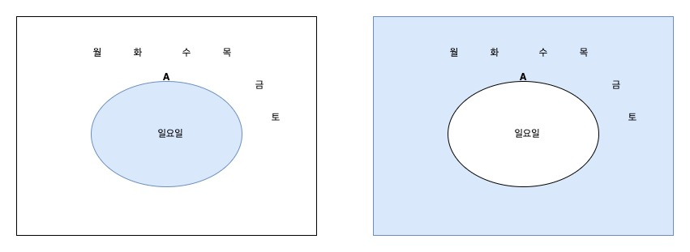
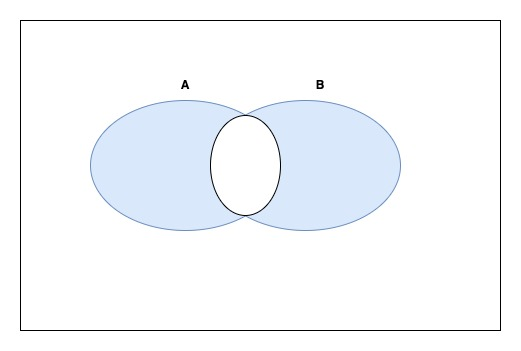

# 목차

- [목차](#목차)
- [1. '없다'는 것이 '있다'라는 의미](#1-없다는-것이-있다라는-의미)
  - [1.2. 2진법](#12-2진법)
    - [1.2.1. 컴퓨터에서 2진법을 사용하는 이유](#121-컴퓨터에서-2진법을-사용하는-이유)
  - [1.3. 지수법칙](#13-지수법칙)
    - [1.3.1. 10의 0승은 무엇인가?](#131-10의-0승은-무엇인가)
    - [1.3.1. 10의 -1승은 무엇인가?](#131-10의--1승은-무엇인가)
  - [1.4. 0의 역할](#14-0의-역할)
    - [1.4.1. 자리 확보](#141-자리-확보)
    - [1.4.2. 패턴을 만들어 규칙을 간단하게 하기.](#142-패턴을-만들어-규칙을-간단하게-하기)
    - [1.4.3. 일상생활에서의 0](#143-일상생활에서의-0)
  - [1.5. 인간 한계와 구조의 발견](#15-인간-한계와-구조의-발견)
    - [1.5.1. 역사를 되돌아보며](#151-역사를-되돌아보며)
    - [1.5.2. 인간의 한계를 넘으려면](#152-인간의-한계를-넘으려면)
- [2. 논리 : true와 false로 나누기](#2-논리--true와-false로-나누기)
  - [2.1. 왜 논리가 중요한가?](#21-왜-논리가-중요한가)
    - [2.1.1. 논리는 애매함을 없애는 도구](#211-논리는-애매함을-없애는-도구)
    - [2.1.2. 논리를 부정적으로 느끼는 분에게](#212-논리를-부정적으로-느끼는-분에게)
  - [2.2. 승차요금 문제: 빠짐없고 겹치지 않는 분할에 대해](#22-승차요금-문제-빠짐없고-겹치지-않는-분할에-대해)
    - [2.2.1. 버스 요금 규칙](#221-버스-요금-규칙)
    - [2.2.2. 명제와 참∙거짓](#222-명제와-참거짓)
    - [2.2.3. 누락은 없는가?](#223-누락은-없는가)
    - [2.2.4. '중복'은 없는가?](#224-중복은-없는가)
    - [2.2.5. 수직선을 그려 생각하기](#225-수직선을-그려-생각하기)
    - [2.2.6. 빠짐없고 겹치지 않는 분할](#226-빠짐없고-겹치지-않는-분할)
    - [2.2.7. 문제를 분할하는 if문](#227-문제를-분할하는-if문)
    - [2.2.8. 논리의 기본은 둘로 나누기](#228-논리의-기본은-둘로-나누기)
  - [2.3. 복잡한 명제 만들기](#23-복잡한-명제-만들기)
    - [2.3.1. 부정 : A가 아니다](#231-부정--a가-아니다)
    - [베타적 논리합 : A 또는 B (그러나 둘 다는 아님)](#베타적-논리합--a-또는-b-그러나-둘-다는-아님)

# 1. '없다'는 것이 '있다'라는 의미

## 1.2. 2진법

### 1.2.1. 컴퓨터에서 2진법을 사용하는 이유

왜?

컴퓨터에서는 수를 표현할 때 다음과 같은 두 가지 상태를 이용한다.

- 스위치가 꺼진 상태
- 스위치가 켜진 상태

2진법의 표는 10진법의 표보다도 훨씬 작고 간단하다.

컴퓨터는 사람처럼 계산 실수를 하지도 않고, 수의 크기를 직관적으로 파악할 필요가 없다.  
컴퓨터는 다루는 숫자의 종류가 적고, 계산 규칙이 간단한 것을 선호한다.

## 1.3. 지수법칙

### 1.3.1. 10의 0승은 무엇인가?

10진법을 설명할 떄 1 === 10의 0승 이다.

10의 0승을 어떻게 정의해야 타당할까?

=> 지수가 1 줄어들면 전체는 10분의 1이 된다.

### 1.3.1. 10의 -1승은 무엇인가?

10의 0승 === 1
10의 -1승 === 1/10

지수가 1 줄어들면 전체는 10분의 1이 된다는 접칙이 적용됨.

**중요한 점은 2의 0승이 무엇인가를 단순히 지식으로 외우지 말라는 것이다.**  
**규칙을 간단하게 하려면 2의 0승은 어떤 값이어야 타당한가를 생각하는 것이 더 중요하다.**  
**즉 기억력의 문제가 아니라 상상력의 문제다.**  
기억해야 하는 것은 **"규칙을" 간단히 하도록 값을 정한다**라는 사고방식이다.

## 1.4. 0의 역할

### 1.4.1. 자리 확보

10진법으로 표기한 2503에서 0은 어떤 역할을 할까요?  
0은 10의 자리가 '없다'라는 것을 나타낸다.  
그러나 없다고 해서 0을 생략할 수는 없다.  
0을 생략하여 253이라 쓰면 전혀 다른 숫자가 되기 때문이다.

0의 역할은 **자리를 확보하는 것이다.**

### 1.4.2. 패턴을 만들어 규칙을 간단하게 하기.

각 자리 숫자를 위에서 부터 순서대로

an, an-1 an, an-2, ... , an, a2, an, a1, an, a0

[an x 10n] + [an -1 x 10n -1] + ... + [a1 x 101] + [a0 x 100]

자리 표기법의 각 자리는 통일되게 ak x 10k 처럼 쓸 수 있다.

아래첨자 k와 지수 k가 일치한다는 점이 포인트다.

### 1.4.3. 일상생활에서의 0

**일정이 없다는 일정**

일정이 없음을 나타내는 곳은 공백일 수가 있다.  
일정을 넣지 않을 예정을 0이라고 생각할 수도 있겠다.  
자리 표기법에서 자리를 확보하고자 0을 사용하는 것과 비슷하다.

## 1.5. 인간 한계와 구조의 발견

### 1.5.1. 역사를 되돌아보며

지금 우리는 자리 표기법에 따른 10진법을 당연한 듯이 사용하고 있다.  
그러나 이렇게 되기까지는 수천 년에 걸친 시간이 소요됐다.

### 1.5.2. 인간의 한계를 넘으려면

근본적인 문제를 생각해보자.

**인간은 왜 수를 표기하는 방법을 고안했을까?**

=> 수가 커질수록 다루기가 어려워지기 때문.

예를들어 로마 표기법 IIIIIIII 와 IIIIIIIIII 어느 것이 더 큰 수일까요?  
한 눈에 알아보기 어렵다.  
그러나 X 와 XI라 표기하면 바로 구분을 할 수 있다.

**현명한 사람들은 큰 수를 표기하고자 덩어리로 묶어 정리하는 방법을 생각해 냈다.**

**커다란 문제는 작은 '덩어리'로 나누어 푼다**의 사고방식을 배울 수 있다.

인간이 우주로 로켓을 발사하고 유전자 정보를 해석하는 수준이 되면  
다루는 수는 폭발적으로 커진다.  
자리표기법으로는 충분치 않다.
1000000000000000, 10000000000000 어느 것이 큰 지 바로 알기 어렵다.

이럴 때 지수를 사용한 표현이 중요해진다.

1013 1014 바로 알 수 있다.

지수를 사용한 표현은 0의 개수에 주목하여 정리한 것.

문제는 수의 표기법에만 한정되지 않는다.  
컴퓨터를 사용하여 인간의 손으로는 따라갈 수 없는 큰 단위의 문제를 풀고자 한다.  
현명하게 프로그래밍하여 거대한 규모의 문제를 얼마나 빠르게 해결하는가에  
노력을 기울인다.  
"커다란 문제는 작은 덩어리로 나누어 푼다"라는 해법은 현대에도 적용 된다.

> 커다란 문제를 풀 때는 여러 개의 작은 덩어리로 나누자.  
> 나눈 덩어리가 여전히 크다면 더 작은 덩어리로 나누자.  
> 적당히 작아졌다면 드디어 이 문제를 풀자.  
> 따라서 대규모의 프로그램을 만들 때도 여러 개의 작은 프로그램(모듈)로 나누어 개발하는 것이  
> 일반적이다.

 
 

# 2. 논리 : true와 false로 나누기

## 2.1. 왜 논리가 중요한가?

### 2.1.1. 논리는 애매함을 없애는 도구

평상시 우리가 사용하는 말(자연 언어)는 아무리 해도 애매하고 부정확하기 쉽다.

사양서(어떤 프로그램을 만들 것인가)는 자연 언어로 쓰는 것이 보통이다.

그러므로 프로그래머는 자연 언어의 애매한 표헌에 헷갈리지 않도록 주의하여 사양서를 읽고  
정확한 의미를 정할 수 있도록 해야 한다.

**이 장에서 배울 '논리' => 자연 언어의 애매함을 없애고, 엄밀하고 정확하게 사물의 상태를 기술하고자 하는 도구.**

사양서를 논리식을 사용하여 표현하면 애매한 부분과 모순이 있는 부분을 발견할 수 있음.
또한 논리의 도움을 빌면 복잡하고 까다로운 사양서를 간단하고 쉽게 이해할 수 있는 형태로 변환 가능

그러므로 프로그래머는 논리라는 도구를 잘 이해하고 이를 자유로이 사용할 수 있도록  
노력을 게을리 해서는 안 된다.

### 2.1.2. 논리를 부정적으로 느끼는 분에게

즐거울 때나 슬플 때나 컴퓨터는 논리적으로 움직인다.

논리는 차갑고 기계적이고 융통성이 없어 라고 생각한다.

맞다. 하지만 반대로 그래서 우리에게 도움을 준다.

## 2.2. 승차요금 문제: 빠짐없고 겹치지 않는 분할에 대해

여기서 '빠짐없고'란 말 그대로 빠진 것 없이 모두 포함함을 의미한다.

### 2.2.1. 버스 요금 규칙

| 승객의 나이가 만 6세 이상 | 1,000원 |
| ------------------------- | ------- |
| 승객의 나이가 만 6세 미만 | 0원     |

### 2.2.2. 명제와 참∙거짓

요금 규칙 A로 승차 요금을 조사할 때는 항상 승객의 나이가 만 6세 이상인가 확인해야 한다.
이때 옳은가 옳지 않은가를 판단할 수 있는 문장을 **명제(Proposition)**라고 한다.

아래의 문장은 명제다

- 철이(만 13세)의 나이는 만 6세 이상이다.

명제가 옳을 때 => 참, 옳지 않을 때 그 명제는 '거짓' 이라고 한다.

### 2.2.3. 누락은 없는가?

누락 => 있어야 할 것이 빠진 것

즉 앞서 설명한 '빠짐없이'라는 논리의 근본 조건을 만족하지 못한다는 의미를

### 2.2.4. '중복'은 없는가?

중복은 없는가도 반드시 확인해야 한다.

### 2.2.5. 수직선을 그려 생각하기

수직선으로 그려 확인하면 직관적이다.

### 2.2.6. 빠짐없고 겹치지 않는 분할

규칙을 생각할 때 '누락'이나 '중복'이 없음을 확인하는 것은 매우 중요하다.

커다란 문제를 만났을 때는 여러 개의 작은 문제로 나누어 푼다.
이럴 때 자주 사용하는 방법이 빠짐없고 겹치지 않는 분할이다.

### 2.2.7. 문제를 분할하는 if문

요금 규칙 A를 이용하여 '승차 요금을 표시하는 프로그램 만들기'라는 문제를
풀어야 한다고 가정하자.

이 문제는 '승객의 나이가 만 6세 이상'이라는 명제가 참일 때와 거짓일 때
두 가지로 나눌 수 있다.

승객의 요금을 표시 -> 나이가 만 6세 이상인 승객, 나이가 만 6세 미만인 승객

### 2.2.8. 논리의 기본은 둘로 나누기

경험이 많은 프로그래머는 "빠짐없고 겹치지 않는 분할'을 의식하지 않고도
if문을 사용할 수 있다. 재빠르게 조건식을 만들고 조건이 참일 때와 거짓일 때를 즉시 작성할 것이다.
특히 여기서 예를 든 간단한 규칙이라면 말이다.

**그러나 모든 문제가 그리 간단하지만은 않다. 프로그래머는 if문을 몇십, 몇백 번 작성한다.**
하나하나 단순하더라도 복잡하게 구성한 if문 안의 어떤 곳에서 한 순간의 실수 떄문에
버그가 발생하곤 한다.

그러므로 간단한 if문이라 하더라도 '빠짐없고 겹치지 않는 분할'이어야 함을 의식하면서
프로그래밍할 필요가 있다.

빠짐없고 겹치지 않는 분할을 조합하여 표현하는 것이 논리의 기본이다.

## 2.3. 복잡한 명제 만들기

명제가 항상 간단한 것은 아니다.

예를들어 "승객의 나이는 만 6세 미만이고 승차일이 일요일이 아니다"

"승객의 나이는 만 6세 미만" + "승차일이 일요일이 아니다"

### 2.3.1. 부정 : A가 아니다

"승차일은 일요일이다" 라는 명제를 기준으로
"승차일은 일요일이 아니다" 라는 명제를 만들 수 있다.
이렇게 ~가 아니다 라는 명제를 만드는 연산을 **부정**이라고 부른다.
영어로는 **not**이라고 표현한다.

> ~A (Not A)

**진리표**

| A     | ~A    |
| ----- | ----- |
| true  | false |
| false | true  |

이 표는 ~이라는 연산자의 정의

- 명제 A가 true라면 명제 ~A는 false다.
- 명제 A가 false라면 명제 ~A는 true다.

이중 부정은 원래로 돌아옴

~~A == a

**벤 다이어 그램**

### 베타적 논리합 : A 또는 B (그러나 둘 다는 아님)

"그는 현재 서울에 있다" "그는 현재 부산에 있다" 라는 명제를 조합하여  
"그는 현재 서울에 있다 또는 그는 현재 부산에 있다" 라는 명제를 만들었다.
여기서 "또는"은 논리 합과 다르다.

그가 현재 서울이나 부산 둘 중 한곳에 있다는 뜻으로

A또는B(그러나 둘 다는 아님)이라는 연산을 배타적 논리합이라고 부른다.
영어로는 exclusive or라고 한다.

논리합과 비슷하지만 A와 B모두 true일 때 처리 방법이 달라진다.

A와 B 한쪽만이 true일 때 true가 되나 양쪽이 모두 true라면 false가 된다.

$$A \oplus B $$

베타적 논리 합은 회로도에 사용된다.
