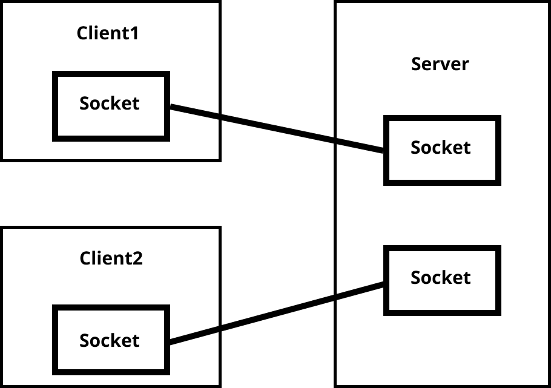
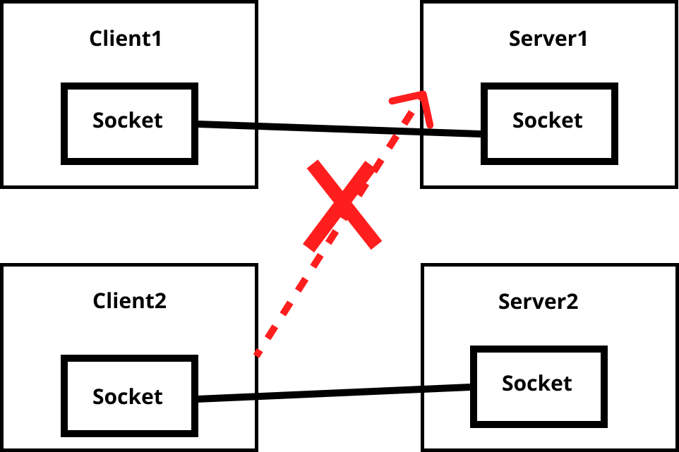
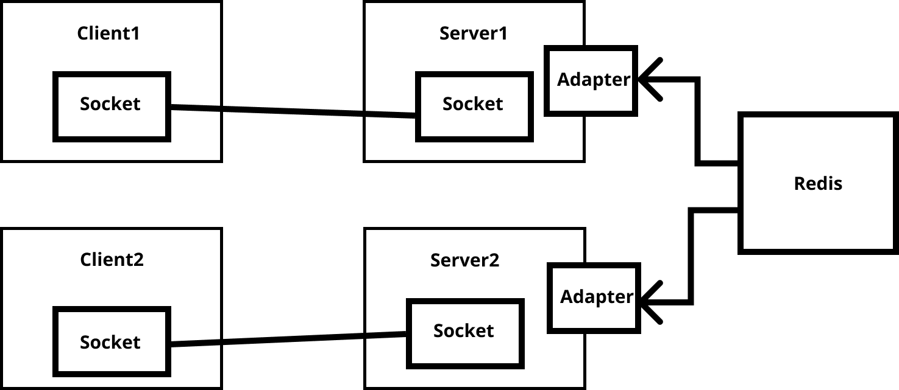

# WebSocket

웹소켓은 컴퓨터 프로토콜의 한 종류

웹소켓 프로토콜은 HTTP 폴링과 같은 반이중방식에 비해 더 낮은 부하를 사용하여  
웹브라우저와 웹 서버 간의 통신을 가능하게 하며,  
서버와의 실시간 데이터 전송을 용이케 한다.

## 동작 방식

- 클라이언트와 서버간에 전이중 통신을 수행하려면 서버로 HTTP UPGRADE 요청을 보내야 한다. => 웹 소켓 프로토콜 핸드 쉐이크
- 서버가 커넥션을 UPGRADE 할 수 있는 경우 HTTP 101 응답을 클라이언트에게 보낸다. 서버는 핸드 쉐이크가 성공적으로 수행되었다고 판단하고
  서버와 클라이언트 사이의 커넥션을 웹 소켓 프로토콜로 UPGRADE 한다. 클라이언트와 서버 사이의 HTTP 101 응답이 전달되는 순간,
  서버와 클라이언트 사이의 커넥션은 HTTP 커넥션이라고 하지 않는다. 그리고 양방향 통신이 가능해진다.
- 웹 소켓으로 연결된 모든 클라이언트는 다른 클라이언트에게 커넥션을 끊는 요청을 전송할 수 있다.

# Socket IO

통신 방식은 아래의 사진과 같다.

출처 : https://socket.io/

## 어뎁터를 사용하는 이유

참고 : https://selfish-developer.com/entry/%EB%A9%80%ED%8B%B0-%EC%84%9C%EB%B2%84-%ED%99%98%EA%B2%BD%EC%97%90%EC%84%9C-Socketio-%EC%82%AC%EC%9A%A9%ED%95%98%EA%B8%B0

어뎁터가 없이 서버가 2대라면 일어날 수 있는 상황

- 10번 방에 트래픽이 몰렸을 때, 10번 방으로 몰리는 트래픽을 분산해줘야 하는데, 양쪽 서버로 분산할 수가 없음.

어뎁터를 각 서버에 붙혀놓는다면 가능해진다.

서버가 하나일 때는 세션이 서버 한 대에 있기 때문에 걱정이 없다.

최초 접속한 서버에 소켓 세션을 유지하기 때문에  
Server1에 접속한 유저와 Server2에 접속한 유저가
다른 데이터를 보게 된다.
따라서 어뎁터에서 세션을 관리하여 모든 서버에 접속한 유저가 같은 데이터를 볼 수 있게 만들어야 한다.

아답터를 붙힌다면, 서버 모두가 레디스를 바라보기 때문에
서버 증설이 가능해진다.
