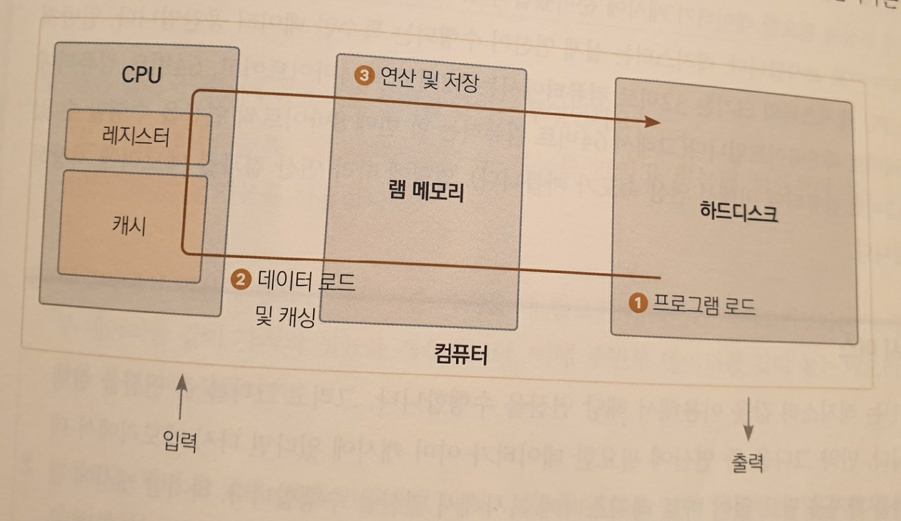

# 1. 컴퓨터 원리

컴퓨터는 매우 단순한 기계다.

아는 것이라고는 0과 1뿐이다.

다만 매우 빠르게 수행할 뿐이다.

컴퓨터는 트랜지스터를 기본 소자로 사용해 발전했다.

1945년 발표된 폰 노이만의 컴퓨터 구조는 현재 컴퓨터에서도 활용된다.

## 1.1. 비트의 탄생과 트랜지스터

트랜지스터 : 연산을 수행하는 가장 기본이 되는 소자.
컴퓨터는 수많은 트랜지스터를 사용해 연산한다.

트랜지스터는 성질이 다른 2가지 실리콘(규소), N형과 P형을 겹쳐 만든다.  
NPN 트랜지스터는 N형 실리콘 사이에 P형을 넣어서 만든다.
가운데 P형을 베이스, 양쪽N을 왼쪽부터 이미터, 콜렉터라고 부른다.
Emit (방출하다), Collect(수집하다.)

### 1.1.1. 트랜지스터와 0과 1

베이스 부분 P에 전압 INPUT = 전류가 흐르고
전압을 가하지 않으면 = 전류가 흐르지 않는다.

이게 마치 스위치를 켜고 끄는 것과 같아서 스위치 기능이라고 부른다.

트랜지스터를 이용해서 0과 1을 표현할 수 있다.  
0과 1 둘 중 하나의 숫자값을 나타내는 공간을 1비트라고 한다.

### 1.1.2. 2진수

숫자 2개를 사용해서 수를 표현하면 2진수.

프로그래머 계산기에서 DEC는 10진수, BIN은 2진수를 의미한다.

Decimal = Dec = 10진수
Binary = Bin = 2진수

2진법 11011이라는 숫자를 표현하기 위해서는 트랜지스터가 5개 필요하다.

트랜지스터 하나로 2진법으로 한 자릿수를 표현하는 것을 1비트bit라고 한다.

1byte = 8bit
1KB = 1024byte
1MB = 1024KB
1GB = 1024MB
1TB = 1024GB
1PB = 1024TB (페타바이트)
1ZB = 1024PB (제타바이트)

## 1.2. 트랜지스터에서 계산기로

### 1.2.1. 논리 소자와 트랜지스터

AND OR XOR NOT

- AND
  두 입력이 모두 1이면 1, 하나라도 0이면 0

- OR

  두 입력이 하나라도 1이면 1 모두 0이면 0

- XOR

두 입력이 서로 다르면 1 같다면 0

- NOT

입력이 하나고 0이면 1을, 1이면 0을 반환.

**AND 소자 구조**

AND 소자면

트랜지스터에서 전류를 흘려 보낼 때, 모든 입력이 1이여야 1이되는 구조를 가졌다.

### 1.2.2. 논리 소자로 사칙연산

## 1.3. 계산기에서 컴퓨터로

트랜지스터를 이용해서 계산기를 만드는 방법을 살펴봤다.  
계산기와 컴퓨터는 엄연히 다르다.  
어떻게 컴퓨터에서 계산기로 발전했는지 알아보자

### 1.3.1. 최초의 상상속 컴퓨터 : 튜링 머신

앨런 튜링이 컴퓨터가 존재하기 전에 상상으로 구현한 기계 ( 컴퓨터)  
튜링머신에 기초하여 컴퓨터가 만들어진다.

영국의 천재 과학자 앨런 튜링 독일의 첨단 암호화 장치인 에니그마를 해독하여 전쟁 승리를 이끔

https://ko.wikipedia.org/wiki 참조

기계는 현재 칸을 읽을 수 있고 칸을 자유자재로 이동할 수 있다.
기계를 조정해 계산을 수행한다.

### 1.3.2. 컴퓨터의 완성 : 폰 노이만 구조


https://m.hanbit.co.kr/channel/category/category_view.html?cms_code=CMS4316945379 참조

폰 노이만의 구조는 현대 컴퓨터에서 모두 사용하는 기본구조다.

폰 노이만의 구조에서 명령은 중앙처리장치인 CPU에서 수행된다.  
프로그램이란 메모리에 올라가서 CPU에 명령어를 순차적으로 제공하는 명령어 묶음이다.

실제로 초창기 컴퓨터는 종이 카드에 구멍을 뚫어서 사용하는 천공카드 다발을 사용해서 컴퓨터에 프로그램 명령어들을 제공했다.

컴퓨터

[ 한 줄의 명령을 읽는다. -> 명령을 수행한다. -> 다음줄로 진전한다 ] 반복

프로그래머는 프로그래밍 언어를 사용하여 어떤 연산을 어떤 순서로 실행할지 정의하는 사람.

## 1.4. 컴퓨터 동작 원리

메모리는 휘발성과 비 휘발성으로 나뉜다.  
램 메모리, 하드디스크다.  
램은 하드보다 빠르지만, 전원 공급이 중단되면 데이터가 날라간다.  
하드디스크는 전원 공급이 중단되도 데이터가 사라지지 않는다.



1. 프로그램 로드

프로그램이 실행 -> <운영체제> 실행 파일을 메모리에 복사.(== load)
이유 : 속도 메모리 > 하드
프로그램 첫 줄부터 한 줄씩 코드를 실행.

2. 데이터 로드 및 캐싱

모든 명령은 CPU에 의해 실행된다.

CPU가 연산을 처리하려면 연산에 필요한 데이터를 가져와야 한다.  
이를 위해 CPU내부에는 캐시라는 별도 메모리 공간이 존재한다.  
캐시는 연산에 필요한 데이터를 보관하는 임시 저장소다.  
램 보다 적은 공간이지만 훨씬 빠르다. (이유 추측 CPU로부터 데이터를 받기 위한 절차가 램보다 더 적기 때문에.)

먼저 메모리에서 연산에 피요한 데이터를 캐시로 복사.  
복사할 때 정확히 연산에 필요한 부분만 복사하는 게 아니라, 근처 데이터도 같이 복사한다.  
다음 연산에 필요한 데이터는 이전 연산에 사용된 데이터와 연속되어 있는 경우가 많기 때문.  
**캐시를 사용할 경우 램 메모리를 이용하는 횟수가 줄어 성능향상.**

3. 연산 및 저장

연산에 필요한 데이터가 캐시에 준비됐다.  
CPU는 연산에 사용할 데이터를 레지스터(register)에 복사한다.  
레지스터는 실제 연산이 수행되는 특수한 데이터 공간이다.

CPU의 레지스터 크기 = 32비트 컴퓨터에서는 32비트 즉 4바이트  
64비트 컴퓨터에서는 8바이트다.  
64비트 컴퓨터는 한 번에 8바이트씩 연산을 수행할 수 있다.  
명령에 따라 연산 결과를 메모리에 저장하기도 한다.

> 캐시미스
>
> CPU는 레지스터 값을 이용해 연산을 수행한다.
> 그리고 그 다음 줄 연산을 실행한다.
> 그 다음 줄 연산에 필요한 데이터가 이미 캐시에 있으면  
> 다시 메모리에서 데이터를 가저올 필요가 없다.  
> 캐시에 없다면 캐시를 비우고 메모리에서 연산에 필요한 데이터를 복사해온다.  
> 이를 캐시미스 (cahce miss)라 부른다.
> 캐시미스가 발생하지 않도록 코딩을 한다면 성능상 이득을 얻을 수 있다.
> **관련 데이터를 연속된 메모리 공간에 저장하면 캐시미스가 덜 발생할 수 있다.**

문제

Q. 16GB짜리 램 메모리 카드가 있다면 이 카드 안에 트랜지스터가 몇 개가 들어 있을까요?

A. 16 x 1024 x 1024 x 1024 x 8

# 2. 프로그래밍 언어

프로그래밍 언어란?

프로그램을 만드는 표현 규약이다.  
컴퓨터는 인간 언어로 된 명령을 이해할 수 없기에, 기계가 알아 들을 수 있는 언어가 필요한데, 이를 기게어라고 부른다.  
기계어는 사람이 해독하기에는 너무 힘들다.

기게어와 인간 언어의 중간에 위치하는 고수준 프로그래밍 언어를 개발했다.

## 2.1. 초창기 프로그래밍 언어

컴퓨터가 알 수 있는 건 오직 0과 1뿐이다.

예를들어 3과4를 더하라는 의미로 "ADD 3 4"명령을 내리고 싶다고 가정.  
가령 ADD를 011로 표현하자는 규칙을 정하는 거다.  
입력 011이 들어오면 내부 회로에서 가산기로 연결하는 스위치를 켜서  
가산기가 수행되도록 만드는 거다.  
이렇게 수행할 명령어를 나타내는 부호를 오퍼레이션 코드 OP라고 부른다.

0011(ADD) 0011(3) 0100(4)

## 2.2. 어셈블리어의 등장

"ADD 3 4" = 어셈블리언어

어셈블리의 사전적 정의 : 여러 개의 부속품을 결합하여 하나의 장치 혹은 구조로 만드는 과정.

연산자 뒤에 숫자 2개를 쓰는 법칙이다.  
기계어와 1:1 매칭이 되기 때문에 매우 빠르고 칩셋마다 명령을 새로 익혀야 한다는 불편함이 존재했다. 어셈블리어는 기계 장치에 직접 코딩하는 임베디드 프로그래밍에 많이 사용된다.

## 2.3. 고수준 언어의 등장

어셈블리언어는 단순한 프로그램에도 코딩 양이 많았기 때문에 불편했다.  
그래서 전체 동작을 이해하기 힘들고 버그 발생 확률도 높았다.

고수준 언어는 높은 가독성, 생산성, 유연한 이식성을 제공한다.

### 2.3.1. 고수준 코드가 실행되기 까지

어떤 프로그래밍 언어로 작성하든 컴퓨터가 명령을 내리면 결국 기계어로 변환되어야 한다.

어셈블리 언어는 1:1 매칭이기 때문에 변환 과정이 매우 빠르고 쉽다.  
고수준 언어는 기계어로 바로 변환될 수 없기 때문에 별도의 프로그램을 사용해야 한다. 이를 컴파일러라고 칭한다.

고수준언어 -> 컴파일 -> 기계어

## 2.4. 프로그래밍 언어의 구분

### 2.4.1. 정적 컴파일 언어 vs 동적 컴파일 언어

미리 컴파일을 해두면 = 정적 컴파일 언어
사용할 때 컴파일하면 = 동적 컴파일 언어

**정적 컴파일 언어**

기계어로 미리 변환해 둔 파일을 실행파일이라고 한다.  
윈도우에서는 .exe가 미리 기계어로 변환된 실행파일이다.  
실행파일 === 기계어 코드
실행할 때 변환 과정이 필요 없어서 빠르고, 타입 에러를 컴파일 시점에서 발견할 수 있어서 타입 안정성이 뛰어나다.

**동적 컴파일 언어**

실행 시점 (run time)에 기계어로 변환하는 방식의 언어를 동적 컴파일 언어라고 한다.

동적 컴파일 언어는 속도도 느린데 왜 개발 됐을까요?

정적 컴파일 언어의 단점을 보완하기 위해.

칩셋과 운영체제마다 0과1로된 바이너리 코드를 표현하는 방식이 다르다.  
기계어로 변환할 때 각 칩셋에 맞게 해줘야 한다.

64,32비트인지 ARM인지 intel기반인지, 운영체제가 뭔지에 따라 달라진다.  
다양한 실행환경을 지원하려면 그만큼 빌드를 많이 해야 한다.

동적 컴파일 언어는 이런 불편함 없이 하나의 코드로 모든 플랫폼에서 실행된다.  
프로그램 실행 시점에 환경에 맞는 기계어로 변환되기 때문이다.

속도대신 범용성을 얻었다.

GO는 정적 컴파일 언어기 때문에 각 플랫폼에 맞는 실행환경을 따로 만들어줘야 한다. 하지만 GO는 내부 환경 변수만 바꿔서 다양한 플랫폼에 맞도록 실행 파일을 만들 수 있어서 비교적 쉽게 대응할 수 있다.

### 2.4.2. 약타입 언어 vs 강타입 언어

12와 "12"는 엄연히 다르다. 12 +"12"를 할 때 1212, 14, 에러 등 다양한 방식으로 해석한다.  
타입 간 연산에 관대한 언어를 약타입, 반대를 강타입언어라고 부른다.

Go는 다른 강 타입 언어에서 지원하는 자동 타입 변환까지도 지원하지 않는 최강타입 언어다.

### 2.4.3. 가비지 컬렉터 유무

가바지 컬렉터 = 쓰레기 청소부  
메모리에서 불 필요한 영역을 치워준다.  
가비지 컬렉터가 없는 언어는 프로그래머가 메모리 할당과 해제를 책임져야 한다.

가비지 컬렉터가 있으면 메모리를 자동으로 해주기 때문에 메모리 관련 문제가 줄어든다는 장점이 존재하지만, 메모리 청소에 CPU 성능을 사용한다는 문제가 있다. 그래서 가비지 컬렉터가 없는 경우 더 빠르다.

GO는 가비지컬렉터가 있다. 매우 발전된 형태의 가비지 컬렉터를 가졌다. 그래서 가지비컬렉터 언어 중에서는 성능이 매우 빠르다.

# 3. Hello go world

- 심플한 문법구조 쉽게 배운다.
- 모던 프로그래밍 기법 다수 지원, 강력한 성능
- 범용 언어기 때문에 어떤 용도로도 가능하지만, 주로 백엔드 서버와 시스템 프로그래밍에 사용된다. 강력한 성능 때문이다.
- 동시성 지원

## 3.1. Go의 역사

- 2009년 발표

## 3.2. Go의 특징

- 클래스 X
- 상속 X
- 메서드 O
- 인터페이스 O
- 익명 함수 O
- 가비지 컬렉터 O
- 포인터 O
- 제네릭 프로그래밍 X
- 네임스페이스 X

## 3.3. 코드가 실행되기까지.

1. 폴더생성

Go언어에서 모든 코드는 패키지 단위로 작성된다.  
같은 폴더에 위치한 .go파일은 모두 같은 패키지에 포함되고, 패키지명으로 폴더명을 사용한다.

폴더가 다르면 패키지도 달라진다.

2. 파일생성

3. Go 모듈생성

1.16버전 이후로 Go모듈이 기본적으로 적용된다. Go코드는 빌드하기 전에 모듈을 생성해야 한다.

```bash
go mod inti goproject/hello
```

go.mod 파일에는 모듈명 go버전 필요한 패키지 목록 담겨져 있음.

4. 빌드

```bash
GOOS=linux GoARCH=amd64 go buoild
```

## 3.4. Hello go world

```go
package main
```

Go 언어의 모든 코드는 반드시 패키지 선언으로 시작해야 한다.  
main패키지는 프로그램 시작점을 포함하는 특별한 패키지.

fmt는 표준 입출력을 다루는 내장 패키지

주석 // /\* \*/ 지원

Println 문자열을 출력하는 함수.

# 4. 변수

변수란 값을 저장하는 메모리 상의 공간  
값에 접근해 값을 변경하는 데에 사용  
변수는 이름, 값, 타입, 주소 속성을 갖는다.  
변수 간 값의 전달은 항상 복사로 일어난다.

1. 변수는 이름이 있다.
2. 변수는 값이 있다.
3. 변수틑 타입이 있다.
4. 변수는 메모리 주소를 나타낸다.

변수를 사용하면 메모리 공간에 이름을 부여하여 쉽고 효과적으로 메모리를 사용할 수 있다.

## 4.1. 변수란?

프로그래밍에서 변수는 값을 저장하는 메모리공간을 가리키는 이름.

컴퓨터 입장에서 프로그램은 '메모리에 있는 데이터를 언제 변경할지를 나타낸 문서'
따라서 메모리에 있는 데이터 조작은 프로그래밍에 있어 핵심. 변수를 이용하면 쉽고 효과적으로 메모리에 있는 데이터를 조작할 수 있다.

## 4.2. 변수 선언

변수를 사용하려면 먼저 변수를 선언해야 한다.  
변수 선언은 컴퓨터에게 값을 저장할 공간을 마련하라고 명령을 내리는 거다.  
이것을 메모리 할당이라고 한다.

```go
var a int = 10
```

```go
package main

import "fmt"

func main() {
  var minimumWage int = 10
  var workingHOur int = 20

  var income int = minimumWage * workingHour

  fmt.Println(minimunWage, workingHour, income)
}
```

정수 타입 변수 minimunWage와 workingHour를 선언하고 각각 10과 20을 대입한다.  
컴퓨터는 변수를 선언할 때

1. 정수 타입 데이터를 저장할 공간을 만든다
2. miniMunWage라고 지징
3. 값 10을 복사

이제 minimunWage라는 변수명을 이요해서 해당 공간에 접근할 수 있다.

## 4.3. 변수에 대해 더 알아보기

Go언어를 더 잘 이해하고 예기치 못한 버그 발생 없이 프로그래밍하려면 변수를 잘 알아야 한다.

### 4.3.1. 변수의 4가지 속성

- 이름 : 프로그래머는 이름을 통해 값이 저장된 메모리 공간에 손쉽게 접근할 수 있다.
- 값 : 변수가 가리키는 메모리 공간에 저장된 값이다.
- 타입 : 변숫값의 형태를 말한다.

### 4.3.2. 변수는 이름을 가지고 있다.

변수를 지을 때 첫글자는 반드시 \_나 문자열로 시작해야 한다.

firstName과 같은 형태를 사용한다.

### 4.3.3. 변수는 타입을 가지고 있다.

타입이 필요한 이유

- 타입은 공간의 크기를 나타낸다. 크기를 알아야지 메모리 주소에서 얼만큼 읽을지 결정할 수 있다. ( 타입을 알면 크기를 알 수 있다. )
- 컴퓨터가 데이터를 해석할 수 있다.

**숫자 타입**
부호 없는 정수 숫자 = uint
부호 있는 숫자 = int
실수 = float
뒤에 붙는 숫자는 비트 단위를 나타낸다.

**그 외 타입**

- 슬라이스 : 가변 길이 배열. 배열은 고정길이로 한 번 길이가 정해지면 바꿀 수 없는 반면 슬라이스는 늘이거나 줄일 수 있다.
- 구조체 : 필드(변수)의 집합 자료구조. 상관관계가 있는 데이터를 묶어놓을 때 사용한다.
- 포인터 : 메모리 주소를 값으로 갖는 타입 포인터를 이용해서 같은 메모리 공간을 가리키는 여러 변수를 만들 수 있다.
- 함수 : 함수를 가리키는 타입 다른말로 함수 포인터라고 한다. 사용할 함수를 동적(런타임에서)으로 바꿀 때 유용하다.
- 인터페이스 : 메서드 정의의 집합
- 맵 : key-value을 갖는 데이터를 저장해둔 자료구조, 키를 사용해 데이터를 찾는 데 특회된 자료구조,
- 채널 : 멀티스레드 환경에 특화된 큐 형태의 자료구조

## 4.4. 변수 선언의 다른형태

```go
package main

import "fmt"

func main() {
  var a int = 3 //기본 형태
  var b int // 초깃값 생략. 초깃값은 타입별 기본값으로 대체
  var c = 4 // 타입생략. 변수 타입은 우변 값의 타입이 됨
  d := 5 // 선언 대입문 := 을 사용해서 var 키워드와 타입 생략

}
```

타입을 생략하면 우변의 타입으로 좌변의 타입이 지정된다.  
정수는 int 실수는 float64가 기본이다.

값을 생략하면 각 타입별로 0, 0.0 fasle "" nil이 선언된다.

## 4.5. 타입 변환

**Go 언어에서는 연산이나 대입에서 타입이 다르면 에러가 발생한다.**

```go
a : = 3
var b float64 = 3.5

var c int = b // float64변수를 int에 대입 불가
d := a * b //다른타입인 int * float64안됨

var e int64 = 7
f := a * e // a 는 int타입 e는 int64타입을 같은 정수값이지만 타입이 달라서 연산 불가.
```

**int \* int64도 에러가 난다.**

같은 숫자 값이라도 타입이 다르면 연산이 안 되기 때문에 타입을 변환해서 연산을 해줘야 한다.
이것을 타입 변환이라고 한다. 타입 변환은 원하는 타입명을 적고
()로 변화시키고 싶은 변수를 묶어준다.

```go
package main

import "fmt"

func main() {
  a := 3 //int
  var b float64 = 3.5 // float

  var c int = int(b) // float64 -> int
  d := float64(a * c) // int -> float64

  var e int64 = 7
  f : = int64(d) * e //float64 -> int64

  var g int = int(b * 3) //float64 -. int
  var h int = int(b) * 3 // float 64 -> int g와 값이 다르다.
  fmt.Println(g, h, f)

}
```

실수 타입 -> 정수 타입 소숫점 이하가 없어진다.

큰 범위 -> 작은범위 값이 달라진다.

```go
package main

import "fmt"

func main () {
  var a int16 = 3456
  var c int8 = int8(a) // int 16 - > int8

  fmt.Println(a)
  fmt.Println(c) // int8인 c 출력
}
```

타입을 변환했더니 c값이 3456에서 -128로 변했다.
2바이트 정수 int16에서 1바이트 정수 int8로 변환할 때
상위 1바이트가 없어지기 때문.

## 4.6. 변수의 범위

변수는 자신이 속한 중괄호 {} 범위를 벗어나면 사라진다.

## 4.7. 숫자 표현

### 4.7.1. 정수 표현

15 를 2진법으로 변환하면 1111이다.
정수는 맨 앞에 부호가 오고 그 뒤로 2진법 값이 온다.
예를들어 15면 0 00001111 이런 식이다.
그렇다면 -15면 1 00001111일까? 아니다.

왜냐면 값이 0 일때는 음수 양수를 구분하지 않아야 하기 때문이다.

게다가 표현할 수 있는 숫자가 하나 줄어서 낭비가 발생한다.  
떄문에 컴퓨터에서 음수의 절댓값의 2의 보수로 표현한다.
2의 보수를 만드는 방법은 모든 1을 0으로 바꾸고 모든 0을 1로 바꾸고 1을 더하면 됨.

그러면 1 11110001 이 된다.

0 00001111
\+ 1 11110001
0 00000000으로 표현할 수 있겠다.

### 4.7.2. 실수의 표현

예를들어 1024.234는 0.1024234 \* 10의4승 으로 나타낼 수 있고,  
0.1024234e+04라고 쓰기도 한다. 1024234가 소수부이고 10의 승수인 4가 지수부다.

# 5. fmt패키지를 이용한 표준 입출력

## 5.1. 표준 입출력

프로그램과 사용자는 입출력을 통해서 상호작용을 한다.  
일반적으로 화면에 출력하고 키보드를 통해 입력받는다.  
입력은 키보드가 아닌 네트워크를 통해 받을 수도 있고 파일을 통해서도 가능하다.

표준 입출력을 사용하면 목적지에 상관없이 간편하게 입출력을 할 수 있다.  
fmt패키지를 사용한다.

### 5.1.1. fmt 패키지

표준 입출력 기능은 go 언어 기본 패키지인 fmt에서 제공한다.

Print() 합수 입력값들을 출력
Println() 함수 입력값들을 출력하고 개행
Printf() 서식에 맞도록 입력값들을 출력

### 5.1.2. 서식문자.

%d, %f, %s ,%v

%d = 10진수 정수값으로 출력 (정수 타입만 가능.)
%f = 지수 형태가 아닌 실숫값 그대로 출력한다. (실수 타입만 가능)
%s = 문자열
%q = 특수문자 기능을 동작하지 않고 문자열 그대로 출력
%T 데이터 타입 출력

### 5.1.3. 최소 출력 너비 지정

```go
package main

import "fmt"

func main(){
  var a = 123
  var b = 456
  var c = 123456789

  fmt.Printf("%5d", "%5d\n", a, b)
  fmt.Printf("%05d, %05d\n", a,b)
  fmt.Printf("%-5d, %-05d\n", a,b)
  fmt.Printf("%5d, %5d\n", c,c)
  fmt.Printf("%05d, %05d\n",c,c)
}
```

%-5d 왼쪽정렬 오른쪽 2칸 남음.
%05d 왼쪽 빈칸을 0으로 채움

최소 너비보다 긴 값을 출력할 땐 무시하고 전부 출력.

### 5.1.4. 실수 소수점 이하 자리수

%f : 실수를 출력한다 예를들어 %5.2f는 최소 너비 5칸에 소수점 이하값 2개를 출력한다
%g : 실수를 정수부와 소수점 이하 숫자를 포함해 출력 숫자를 제한한다.

### 5.1.5. 특수문자

\t 탭 삽입
\\\ \ 자체를 출력

```go
str := "Hello\tGo\t\tWorld\n\"Go\"is Awesome!\n"
fmt.Printf("%q", str) ==> 문자열 그대로 출력
```

## 5.2. 표준입력

Scan() 표준입력에서 값을 입력받습니다.
Scanf() 표준 입력에서 서식 형태로 값을 입력받습니다.
Scanln() 표준 입력에서 한 줄을 읽어서 값을 입력받습니다.

### 5.2.2. Scan()

Scan() 함수는 값을 채워넣을 변수들의 메모리 주소를 인수로 받는다.

```go
func main() {
  var a int
  var b int

  n,err := fmt.Scan(&a,&b)
}
```

### 5.2.3. Scanf()

Scanf는 함수 서식에 맞춘 입력을 받는다.

숫자 2개를 입력받는 예시

```go
var a int
var b int

n,err := fmt.Scanf("%d %d\n", &a, &b)

```

### 5.2.4. Scanln()

Scanln는 한 줄을 입력 받아서 인수로 돌아온 변수 메모리 주소에 값을 채운다.

Scan()과 다른 점은 마지막 입력값 이후 반드시 enter키로 입력을 종료해야 한다는 점이다.

```go
var a int
var b int

n,err := fmt.Scanln(&a, &b)
```

## 5.3. 키보드 입력과 Scan()함수의 동작 원리

사용자가 표준 입력 장치로 입력하면 입력 데이터는 컴퓨터 내부에 표준 입력스트림이라는 메모리 공간에 임시 저장된다. Scan()함수들은 그 표준 입력 스트림에서 값을 읽어서 입력값을 처리한다.

표준 입력 스트림에서 **스트림이란** 흐름이라는 뜻을 가진다.  
입력 데이터가 연속된 데이터 흐름 형태를 가지고 있다는 뜻이다.  
데이터가 A포인트에서 B포인트로 흘러간다고 해서 파이프라고 부르기도 한다.

hello4를 입력받으면

\n4 o l l e H 이런 형태로 저장된다.
왜냐면 가장 먼저 입력한 데이터부터 읽어오기 때문이다.

먼저 입력된 데이터가 먼저 읽히는 데이터 구조를 FIFO(First in First Out)라고 말한다.
표준 입력 스트림은 바로 FIFO구조를 가지고 있다.

# 6. 연산자

## 6.1. 산술연산자

### 6.1.1. 연산의 결과 타입

Go 언어에서 모든 연산자의 **각 항의 타입은 항상 같아야 한다.**
예를들어 정수와 실수를 서로 더하거나 뺼 수 없다.
타입 변환을 통해 타입을 같도록 맞춰준 다음에 연산을 해야 한다.

### 6.1.2. 비트 연산자

& | ^ ^& 비트 단위로 연산하는 비트 연산자다. 정수만 피연산자가 될 수 있다.
컴퓨터의 모든 값은 0과 1로 표현되고 이를 1비트라고 한다.

비트 연산자는 각 비트 단위로 연산을 수행한다. 그래서 비트 연산을 위해서는 먼저
정숫값을 2진수로 표현한 뒤 계산해야 한다.

**& ( AND 연산자 )**

A =1 B =1 일때만 A&B = 1

10 & 34 = 2

10 = 0000 1010
& 34 = 0010 0010
2 = 0000 0010

**| (OR 연산자)**

10 = 0000 1010
34 = 0000 0010

42 = 0010 1010

**^(XOR연산자)**

A ^B연산을 수행할 때 A와 B가 다르면 1이 된다.

**&^(비트 클리어 연산자)**

특정 비트를 0으로 바꾸는 연산자입니다.

10 &^ 2
^연산을 수행 한다 -> &연산을 수행한다.

0000 0010

1111 1101

0000 1010

0000 1000

### 6.1.3. 시프트 연산자

비트를 왼쪽 또는 오른쪽으로 당기는 연산자

**<<왼쪽시프트**

오른쪽 피연산자값 만큼 전체 비트를 왼쪽으로 밀어낸다.
이떄 비트가 이동되어 빈 자리는 0이 채워지고 자리수를 벗어난 비트는 버려진다.

```go
package main

import "fmt"

func main() {
  var x int8 = 4
  var y int8 = 64

  fmt.Printf("x:%08b x<<2: %08b x<<2: %d\n", x, x << 2, x << 2) // 16
  fmt.Printf("x:%08b x<<2: %08b x<<2: %d\n", y, y << 2, y << 2) // 0
}
```

1번의 값은 2의 승수와 같은 결과

2번의 값은 64는 2진수로 0100 0000
전체 비트를 왼쪽으로 2칸 밀면 0001 0000 0000 01이 두칸 밀려서 0이 된다.

승수를 구할 때 사용하기 좋다.

**>> 오른쪽시프트**
비트값을 오른쪽으로 민다.

00010000 x >> 2 0000100 16은 4가 된다. 4

## 6.2. 비교 연산자

### 6.2.1. 정수 오버플로

정수가 정수 타입의 범위를 벗어난 경우 값이 비정상으로 변화하는 현상을 오버플로라고 한다.

x가 정수타입일 떄 x < x+ 1 을 항상 만족하지 못할 수 있다.

```go
    fmt.Printf("%d < %d +1: %v\n", x, x, x < x + 1)
```

int8 은 -128 ~ 127까지다. 근데 +1을 해서
1000 0000 이 되어서 최상이비트가 0에서 1로 바뀌었다. -128이 되어버리기 때문에, false가 나오는 것이다.

### 6.2.2. 정수 언더플로

마찬가지로 가장 작은 값에서 -1 했을 때 가장 큰 값으로 바뀐다.

### 6.2.3. float 비교 연산

실수 연산에서

```go
var a float64 = 0.1
var b float64 = 0.2
var c float64 = 0.3

a + b == c  // false
a + b // 0.3000000000000004
```

## 6.3. 실수 오차

컴퓨터에서 실숫값을 표현할 때 지수부와 소수부로 나눠서 표현한다.
컴퓨터는 지수부와 소수부가 10진수 기준이 아니라 2진수 기준으로 되어 있습니다.

그래서 10진수 실수를 정확히 표현하기 어렵다.

0.375 = 0.3 + 0.07 + 0.005

1 \* 2 -2승 + 1 x 2 -3승

0.376은 2의 음의 승수료 표현하기 어렵다.

0.375에서 0.001 더한 값은 2의 승수값을 찾기가 어렵다.

그래서 0.375값은 float32 최대한 가깝게 표현하면
0.37599987125396....

이 문제를 어떻게 해결해야 할까요?

### 6.3.1. 작은 오차 무시하기

```go
func equal(a, b float64) bool {
  if a > b {
    if a -b <= epsilon {
      return true
    } else {
      return false
    } else {
      if b -a <= epsilon {
        return true
      } else {
        return false
      }
    }
  }
}
```

### 6.3.2. 오차를 없애는 더 나은 방법

## 6.4. 논리연산자

## 6.5. 대입연산자

a, b = 3, 4

### 6.5.2. 복합 대입 연산자

### 6.5.3. 증감 연산자

요약

실수 타입은 서로 값이 같은지 비교하는 == 연산자가 비정상 동작할 수 있다.
