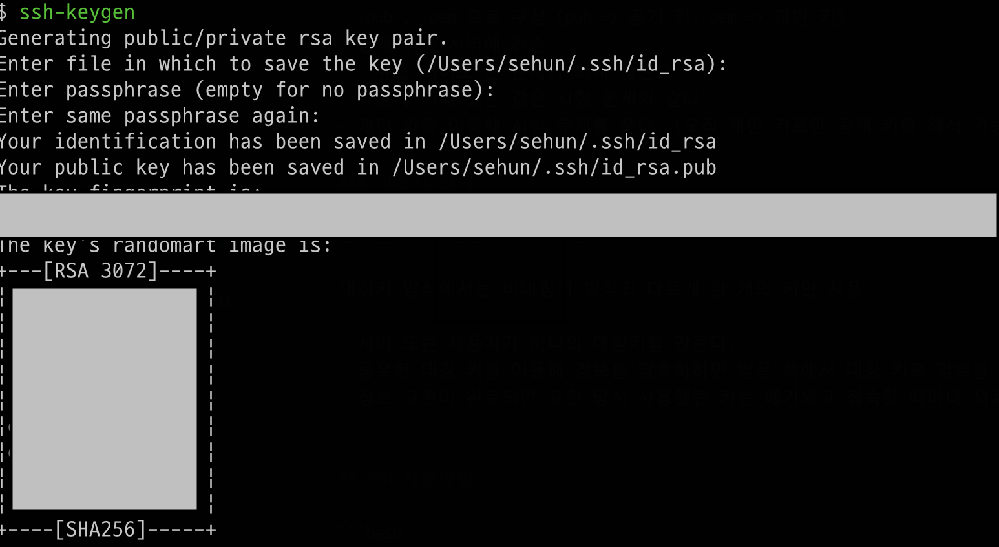
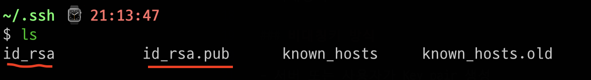

# SSH란?

Secure Shell의 줄임말.

원격 호스트에 접속하기 위해 사용하는 보안 프로토콜

과거에는 Telnet을 사용했다. Telnet은 암호화가 되지 않아, SSH가 탄생했다.

## SSH 동작원리

사용자, 서버는 각각의 키를 갖고 있다.
이 키를 이용하여 연결한다.

키 생성 방법은 두 가지다.

- 대칭키
- 비대칭키

### 비대칭키 방식

- 서버 또는 사용자가 Key pair 생성
- .pub , .pem 으로 구성 (pub => 공개 키, pem => 개인 키)
- 공개 키를 서버에 전송
  - 유출 되어도 큰 문제가 되지 않는다.
  - 공개 키에 있는 값은 시험 문제와 같다.
- 개인 키를 이용해 시험 문제를 푼다. (오직 개인 키로만 공개 키를 해석 가능)

### 대칭키 방식

정보를 주고 받는 과정에 사용

대칭키 방식에서는 비대칭키 방식과 다르게 한 개의 키만 사용

- 서버 또는 사용자가 하나의 대칭키를 만든다.
- 공유된 대칭 키를 이용해 정보를 암호화하면 받은 쪽에서 대칭 키로 암호를 푼다.
- 정보 교환이 완료되면 교환 당시 사용했던 키는 폐기되고 접속할 때마다 새로운 대칭 키를 생성

## SSH 사용방법

### keygen

```bash
ssh-keygen
```




아래와 같이 pub과 pem이 생성된다.

### 서버에 pub key 넣기

서버 **.ssh/authorized_keys**에 pub키 내용을 그대로 넣어준다.

> 공개키를 여러개 등록할 경우에는 끝에 띄어쓰기 후 이어서 붙힌다.
> **줄바꿈은 특정 터미널에서 읽지 못하는 경우가 있다.**  
> ssh-rsa 키값 test1 ssh-rsa 키값 test2 ssh-rsa 키값 계정명@DESKTOP-123456

**더하기**

authorzed_keys 파일에 대해 권한을 부여해야 한다.

```bash
chmod 400 file
```

[chmod에 대한 설명](./mix.md###chmod)

## SSH 접속 시 포트 및 호스트 이름 생략

```vim
# 로컬 ~/.ssh/config

Host 102.102.122.22
        User username
        Port 60002

Host dev
        HostName 102.102.122.22
        User username
        Port 60002
```

```vim
# 로컬 /etc/hosts
101.101.164.55 dev
```

이렇게 작성하면

```bash
ssh dev
```

로 접속 가능.
